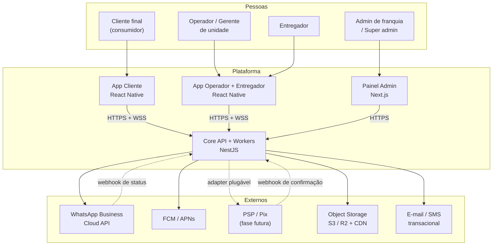
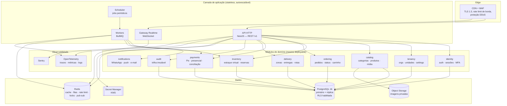
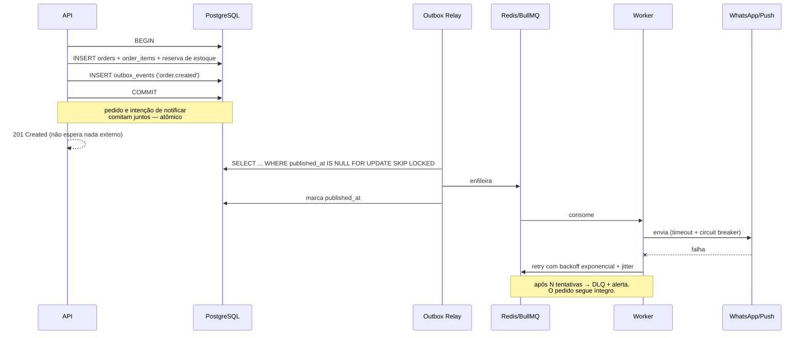

# 01 — Arquitetura do Sistema

> Item 2 da Regra Fundamental: **a arquitetura proposta**.

---

## 1. Visão de contexto (C4 — Nível 1)



**Leitura-chave:** as setas para os sistemas externos saem **apenas** da API, nunca dos apps. Nenhum
aplicativo mobile fala com WhatsApp, PSP ou storage privado diretamente — se falasse, precisaria carregar
credenciais, e credencial em app é credencial pública.

---

## 2. Visão de contêineres (C4 — Nível 2)



### Por que 4 processos e não 1

| Processo | Motivo de existir separado |
|---|---|
| **API HTTP** | Escala com o tráfego de leitura de cardápio; precisa de latência previsível |
| **Gateway Realtime** | Conexões WebSocket são longas e mudam o perfil de memória; escalar junto com HTTP desperdiça recursos e reinício de deploy derrubaria todas as conexões |
| **Workers** | Uma fila travada (WhatsApp lento) **não pode** consumir threads da API — isolamento de falha (*bulkhead*) |
| **Scheduler** | Instância única com lock distribuído; jobs periódicos não podem rodar N vezes por réplica |

Todos compartilham o mesmo código-base e a mesma imagem — mudam apenas o *entrypoint*. Custo operacional
de monolito, isolamento de falha de serviços.

---

## 3. Stack e justificativas

| Camada | Escolha | Alternativa considerada | Por que a escolha |
|---|---|---|---|
| Mobile | React Native 0.7x + Expo (dev client) + TypeScript | Flutter | Uma linguagem em toda a stack; tipos e cliente HTTP gerados do OpenAPI compartilhados com o backend; OTA (EAS Update) para correções sem esperar revisão de loja. Flutter é tecnicamente equivalente em performance — perderíamos o compartilhamento de tipos. [ADR-0003](adr/ADR-0003-react-native-expo.md) |
| Estado no app | TanStack Query (servidor) + Zustand (UI/carrinho) | Redux Toolkit | Cache, revalidação, retry e offline saem de graça; o carrinho é o único estado local relevante |
| Painel admin | Next.js (App Router) | Mesmo RN via web | Painel é uso desktop, com tabelas densas e relatórios — DOM nativo é melhor |
| Backend | NestJS + TypeScript | Fastify puro, Go, Spring | Guards/Interceptors/Pipes mapeiam exatamente em autenticação → escopo de tenant → RBAC → validação; DI facilita ports & adapters. Go ganharia em latência bruta, perderia em velocidade de entrega e stack única (C3) |
| ORM | **Drizzle** | Prisma | Precisamos de `UPDATE … WHERE` condicional, `FOR UPDATE`, CTE, índice parcial e `SET LOCAL` para RLS — tudo tipado e parametrizado, sem escapar para SQL cru no caminho crítico. [ADR-0004](adr/ADR-0004-postgresql-drizzle.md) |
| Banco | PostgreSQL 16+ (+ PostGIS) | MySQL, MongoDB | RLS, transações reais, `JSONB`, índices parciais, particionamento e PostGIS para zonas de entrega. NoSQL seria escolha errada para dados fortemente relacionais e transacionais |
| Cache / filas | Redis 7 + BullMQ | SQS + ElastiCache | Um componente serve cache, rate limit, lock distribuído, pub/sub do WS e filas com retry/DLQ |
| Validação | Zod (compartilhado app ↔ API) | class-validator | Um schema define validação **e** tipo; o app valida cedo para UX, o servidor valida de novo por segurança |
| Contrato | OpenAPI 3.1 gerado do código | GraphQL | Cache HTTP e rate limit por rota são triviais em REST; GraphQL exigiria controle de complexidade de query como superfície extra de ataque |
| Auth | JWT assimétrico (EdDSA) + refresh opaco | Sessão de servidor, Auth0/Cognito | Controle total sobre rotação, revogação e MFA sem custo por MAU e sem *lock-in*. [ADR-0005](adr/ADR-0005-tokens-e-sessoes.md) |
| Infra | Containers (ECS Fargate/K8s) + RDS + ElastiCache + S3 + Secrets Manager | Serverless puro | Conexões persistentes (WS) e pool de banco não combinam com Lambda; Fargate dá autoscaling sem gerir nós |

---

## 4. Organização do código (monorepo)

```
repo/
├─ apps/
│  ├─ mobile-customer/       # App do cliente (RN)
│  ├─ mobile-operator/       # App do operador + entregador (RN)
│  ├─ admin-web/             # Painel (Next.js)
│  └─ api/                   # NestJS: http | ws | worker | scheduler
├─ packages/
│  ├─ contracts/             # Schemas Zod + tipos + client gerado do OpenAPI
│  ├─ ui/                    # Design System (tokens, temas por franquia)
│  ├─ domain/                # Regras puras: máquina de estados, cálculo de totais
│  └─ config/                # ESLint, TS, Jest compartilhados
└─ docs/                     # esta documentação
```

O pacote **`domain`** é código puro, sem I/O: máquina de estados do pedido, cálculo de subtotal/taxa/total,
regras de disponibilidade. É testável em milissegundos e é reutilizado pelo app (para *preview* otimista)
e pelo servidor (para a **decisão real**). O app usa para mostrar; o servidor usa para cobrar.

### Anatomia de um módulo (ports & adapters)

```
modules/inventory/
├─ domain/          # entidades e invariantes, sem dependências externas
├─ application/     # casos de uso (ReserveStock, MarkSoldOut, ReleaseExpired)
├─ ports/           # interfaces (InventoryRepository, EventPublisher)
├─ infrastructure/  # adapters Drizzle/Redis que implementam os ports
└─ interface/       # controllers HTTP, handlers de fila, gateways WS
```

**Regra de fronteira, verificada por lint:** um módulo só importa de outro através de `application` ou
`ports` — nunca `infrastructure` ou `domain` alheios. É o que mantém a opção de extrair
`notifications` e `payments` para serviços próprios sem arqueologia.

---

## 5. Contrato de API

| Aspecto | Decisão |
|---|---|
| Estilo | REST sobre HTTPS, `/v1` no path; versão só quebra em mudança incompatível |
| Erros | RFC 9457 `application/problem+json` — `type`, `title`, `status`, `detail`, `code`, `traceId`. Mensagens **nunca** revelam existência de recurso de outro tenant |
| Paginação | Cursor opaco (`?cursor=&limit=`), limite máximo 100 — evita `OFFSET` caro e enumeração |
| Idempotência | `Idempotency-Key` **obrigatório** em `POST /orders`, `POST /payments/*` e confirmações de status |
| Concorrência | `ETag` + `If-Match` em recursos editáveis (produto, preço, configuração) — bloqueia *lost update* entre operadores |
| Tamanho | Corpo limitado a 256 KB (1 MB no upload de metadados); rejeição na borda |
| Compressão | Brotli/Gzip; `Cache-Control` + `ETag` no cardápio público |
| Tenancy | **Nunca** por header enviado pelo cliente. O escopo vem do token + do próprio recurso |

### Superfície de rotas (resumo)

```
Público (sem sessão, com rate limit agressivo)
  GET  /v1/public/branches/:slug                 → vitrine da unidade
  GET  /v1/public/branches/:id/menu              → cardápio + disponibilidade (cacheado)

Cliente autenticado
  POST /v1/orders                                → cria pedido (Idempotency-Key)
  GET  /v1/orders/:id                            → detalhe (apenas do próprio cliente)
  POST /v1/orders/:id/cancel                     → cancelamento em janela permitida
  GET  /v1/me/addresses  · POST /v1/me/addresses

Operação (escopo de unidade obrigatório)
  GET   /v1/branches/:branchId/orders            → fila de pedidos (filtro por status)
  POST  /v1/branches/:branchId/orders/:id/transition
  PATCH /v1/branches/:branchId/products/:id
  POST  /v1/branches/:branchId/inventory/:productId/sold-out
  POST  /v1/branches/:branchId/inventory/:productId/adjust
  POST  /v1/branches/:branchId/payments/:id/confirm

Administração
  POST  /v1/organizations/:orgId/branches
  PUT   /v1/branches/:branchId/pix-settings
  GET   /v1/organizations/:orgId/audit-logs

Webhooks (assinados, IP allowlist quando disponível)
  POST /v1/webhooks/whatsapp
  POST /v1/webhooks/payments/:provider
```

`branchId` aparece no path por clareza de auditoria e cache — **mas nunca é fonte de autoridade**:
o servidor confere que o recurso pertence àquele `branchId` *e* que o ator tem escopo sobre ele
(ver [`06-modelo-de-permissoes.md`](06-modelo-de-permissoes.md)).

---

## 6. Fluxo de requisição (pipeline de cada chamada)

```mermaid
sequenceDiagram
    participant App
    participant Edge as CDN/WAF
    participant API as NestJS
    participant PG as PostgreSQL (RLS)

    App->>Edge: HTTPS
    Edge->>Edge: TLS 1.3 · DDoS · rate limit de borda · tamanho do corpo
    Edge->>API: request + trace-id
    API->>API: 1. Helmet, CORS, limite de payload
    API->>API: 2. Rate limit por IP + por identidade (Redis)
    API->>API: 3. Autenticação (verifica JWT, sessão viva, token_version)
    API->>API: 4. Monta TenantContext (AsyncLocalStorage)
    API->>API: 5. Autorização RBAC (permissão + escopo)
    API->>API: 6. Validação Zod (allowlist — sem mass assignment)
    API->>PG: BEGIN; SET LOCAL app.current_org / app.branch_scope
    PG->>PG: 7. RLS filtra por tenant (rede de segurança)
    PG-->>API: resultado
    API->>PG: audit_logs (mesma transação) ; COMMIT
    API-->>App: resposta + ETag ; eventos via outbox
```

Sete camadas antes de tocar um dado. As camadas 4, 5 e 7 são independentes e **redundantes de propósito**:
falha de uma não vira vazamento.

---

## 7. Comunicação assíncrona — Transactional Outbox

O problema clássico: como garantir que "pedido criado" e "avisar no WhatsApp" não fiquem inconsistentes,
sem colocar o WhatsApp dentro da transação?



Garantias: **at-least-once** na entrega, com chave de idempotência por evento para o consumidor
deduplicar. `FOR UPDATE SKIP LOCKED` permite múltiplos relays em paralelo sem processar o mesmo evento.

**Eventos de domínio publicados:** `order.created`, `order.status_changed`, `order.cancelled`,
`payment.pending`, `payment.confirmed`, `inventory.sold_out`, `inventory.low`, `user.password_changed`,
`session.suspicious_login`.

---

## 8. Tempo real e notificações

| Situação | Canal | Racional |
|---|---|---|
| App operador aberto | **WebSocket** (sala `branch:{id}`) | Pedido precisa aparecer na hora, com som |
| App operador em background | **FCM/APNs high-priority** | Sistema operacional acorda o app |
| Cliente com app aberto | WebSocket (sala `order:{id}`) | Status ao vivo na tela de acompanhamento |
| Cliente com app fechado | Push + WhatsApp (template) | Redundância proposital: push falha em silêncio com frequência |
| Painel admin | WebSocket + polling de fallback | Rede corporativa às vezes bloqueia WS |

Autenticação do WebSocket usa o **access token no handshake** (nunca na query string, que vaza em log
de proxy), com re-autorização a cada `join` de sala. O Redis Pub/Sub faz o fanout entre as instâncias
do gateway. Se o WS cair, o app faz *polling* com backoff — **degradação, não quebra**.

---

## 9. Desempenho e cache

| Dado | Estratégia | Invalidação |
|---|---|---|
| Cardápio da unidade | Redis (TTL 5 min) + `ETag`/`Cache-Control: private, max-age=60` | Evento em produto/preço/categoria |
| Disponibilidade de estoque | **Nunca cacheada junto do cardápio.** Campo volátil, resolvido no momento da leitura e reconfirmado no checkout | — |
| Configurações e branding | Redis (TTL 15 min) | Evento de `settings.updated` |
| Permissões do usuário | Redis (TTL 5 min), chaveado por `user_id:token_version` | Bump de `token_version` invalida tudo |
| Sessão/refresh | Postgres (fonte da verdade) + Redis (leitura quente) | Revogação escreve nos dois |

A separação "cardápio cacheável / disponibilidade volátil" é deliberada: cachear estoque criaria
**overselling visível**. O cliente pode ver um cardápio de 60 s atrás; ele **não pode** ter um pedido
aceito com base em estoque velho — e a reserva atômica no checkout é a garantia final.

Outros ganhos: índices parciais para as consultas quentes (fila de pedidos ativos), réplica de leitura para
relatórios, projeção `menu_snapshot` (`JSONB`) para renderizar cardápio grande em uma consulta.

---

## 10. Resiliência

| Padrão | Aplicação |
|---|---|
| Timeout | Toda chamada externa: 5 s de conexão, 10 s total. Sem timeout = *leak* garantido |
| Circuit breaker | Por provedor (WhatsApp, PSP, push): abre após taxa de erro, semiabre depois de 30 s |
| Bulkhead | Filas separadas por criticidade: `orders` ≠ `notifications` ≠ `reports` |
| Retry | Backoff exponencial **com jitter**, só em erro transitório (5xx, timeout); nunca em 4xx |
| DLQ | Fila morta por tipo, com alerta e reprocessamento manual |
| Graceful shutdown | Drena conexões e jobs em andamento antes de encerrar (deploy sem pedido perdido) |
| Health checks | `/health/live` (processo) e `/health/ready` (Postgres + Redis) separados |
| Degradação | Sem WhatsApp: pedido segue, notificação enfileira. Sem Redis: cache vira *miss* e rate limit cai para modo restritivo em memória — **falha fechada**, não aberta |

---

## 11. Ambientes, CI/CD e operação

**Ambientes:** `dev` → `staging` (dados sintéticos, nunca cópia de produção com PII real) → `production`.
Contas cloud separadas; nenhuma credencial compartilhada entre ambientes.

**Pipeline (bloqueante):** lint + typecheck → testes unitários → testes de integração com Postgres real
(inclui a **suíte de isolamento de tenant** e o **teste de concorrência de estoque**) → SAST (CodeQL/Semgrep)
→ SCA de dependências → verificação de segredos vazados → build de imagem assinada + SBOM → migração de
schema → *rolling deploy* → smoke test → *rollback* automático por SLO.

**Migrações:** sempre compatíveis para trás (expandir → migrar → contrair), aplicadas antes do deploy do
código que as usa. Nada de `DROP COLUMN` no mesmo release que para de usá-la.

**Observabilidade:** OpenTelemetry ponta a ponta com `trace_id` propagado do app até o worker;
logs estruturados em JSON com **redação obrigatória** de token, senha, chave Pix e CPF; métricas de negócio
(pedidos/min, taxa de rejeição por falta de estoque, latência de confirmação de Pix, lag do outbox) ao lado
das métricas técnicas — porque o alerta que importa é "pedidos pararam de entrar", não "CPU em 80%".

---

## 12. Como cada requisito crítico é atendido

| Requisito | Onde está resolvido |
|---|---|
| Isolamento entre unidades (RF-02) | Guard de escopo + RLS — [`06`](06-modelo-de-permissoes.md), [`sql/rls-policies.sql`](sql/rls-policies.sql) |
| Última unidade em disputa (RF-08) | `UPDATE` condicional atômico + reserva com TTL — [`05`](05-fluxo-de-estoque-virtual.md) |
| Preço imune a manipulação (D4) | Recálculo no servidor + snapshot em `order_items` — [`04`](04-fluxo-de-pedido.md) |
| WhatsApp fora do ar não derruba pedido (RF-10) | Outbox + workers + circuit breaker — §7 e [`08`](08-integracao-whatsapp.md) |
| Pix sem confirmação automática hoje (RF-05) | `PaymentProvider` com adapter manual auditado — [`10`](10-pagamentos.md) |
| Histórico imutável (RF-09) | Trigger anti-`UPDATE`/`DELETE` + cadeia de hash — [`02`](02-modelo-de-dados.md) |
