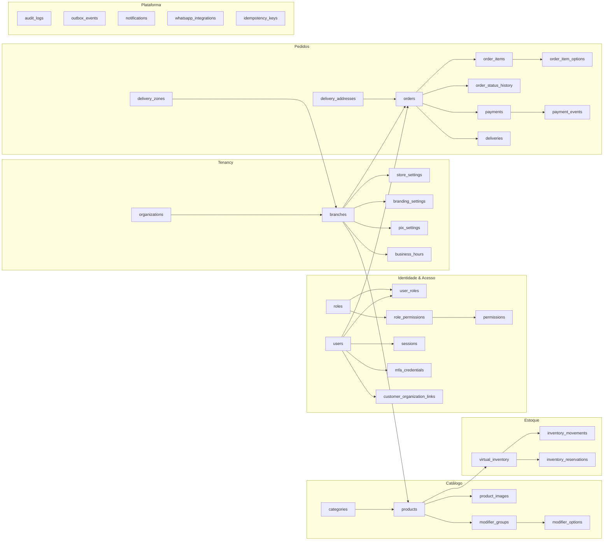
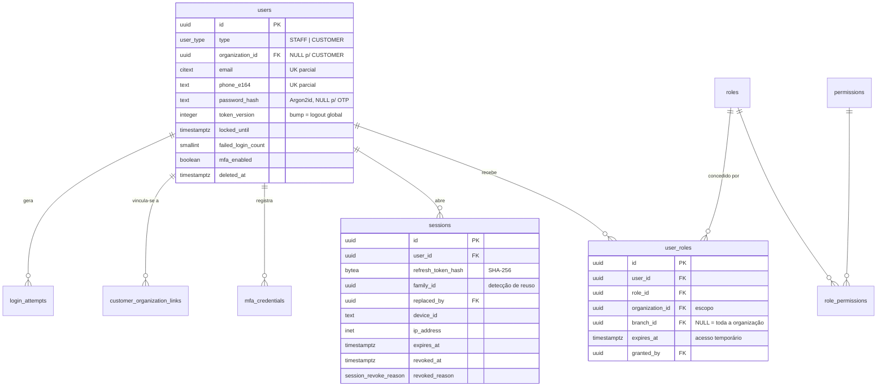
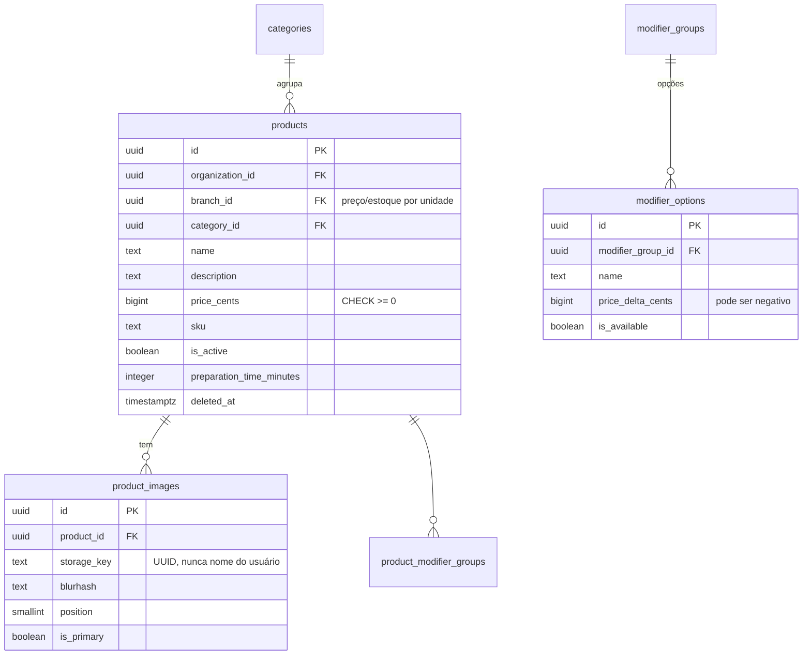
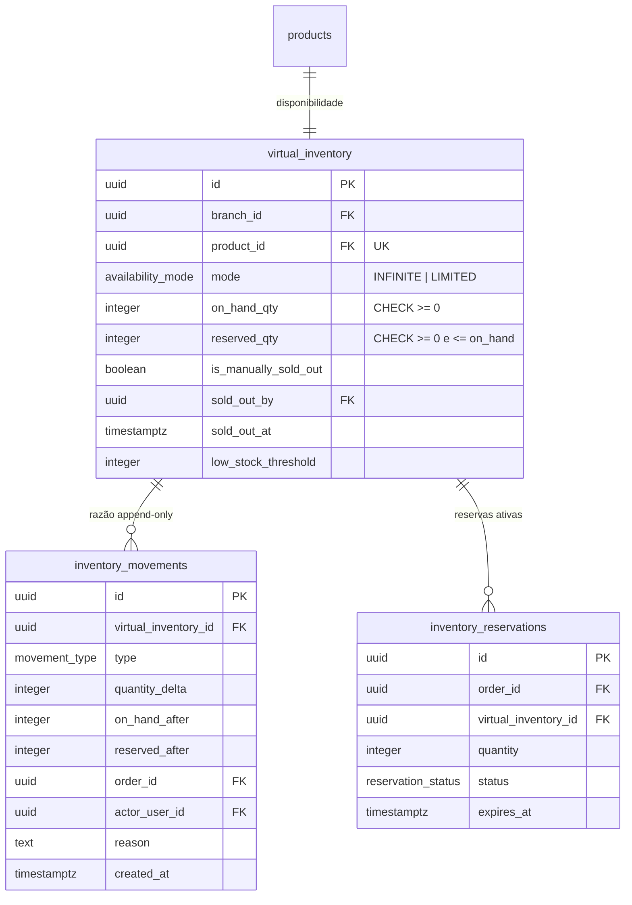
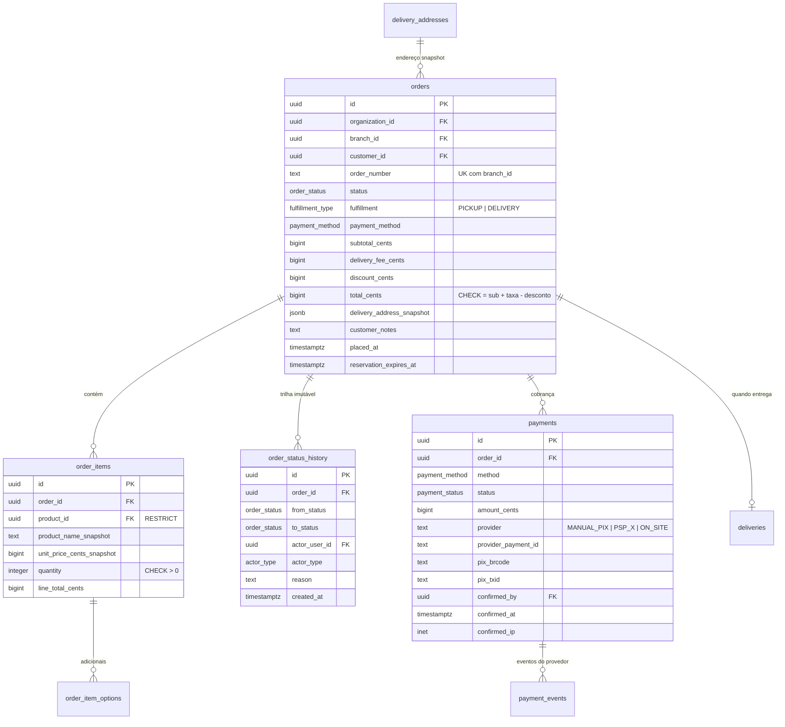
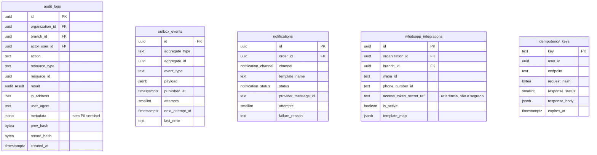

# 02 — Modelo de Dados

> Item 3 da Regra Fundamental. DDL executável completo em [`sql/schema.sql`](sql/schema.sql);
> políticas de isolamento em [`sql/rls-policies.sql`](sql/rls-policies.sql).

---

## 1. Convenções aplicadas a todo o schema

| Convenção | Regra | Motivo |
|---|---|---|
| Chave primária | `UUID` gerado como **UUIDv7** (ordenável no tempo) | Não enumerável (anti-IDOR) e com boa localidade de índice, diferente do UUIDv4. [ADR-0010](adr/ADR-0010-dinheiro-em-centavos-e-uuidv7.md) |
| Dinheiro | `BIGINT` em **centavos** + `currency CHAR(3)` | `FLOAT`/`REAL` em dinheiro é defeito financeiro; `NUMERIC` seria aceitável, centavos evita qualquer ambiguidade de arredondamento |
| Tempo | `TIMESTAMPTZ` sempre, gravado em UTC | Unidades em fusos diferentes; horário local é apresentação, não armazenamento |
| Tenancy | Toda tabela de negócio carrega `organization_id`; tabelas operacionais carregam também `branch_id` | Chave de RLS **e** futura chave de shard. Redundância deliberada: evita `JOIN` só para autorizar |
| Soft delete | `deleted_at TIMESTAMPTZ NULL` em catálogo, usuários e configurações | Pedido histórico não pode apontar para produto inexistente |
| Nunca soft delete | `orders`, `order_items`, `order_status_history`, `payments`, `audit_logs`, `inventory_movements` | Registro fiscal/contábil/auditoria: cancela-se por **status**, não se apaga |
| Timestamps | `created_at`, `updated_at` (trigger) em todas as tabelas mutáveis | Auditoria mínima e depuração |
| Nomes | `snake_case`, tabela no plural, FK `<entidade>_singular_id` | Consistência mecânica |
| Enums | Tipos `ENUM` nativos do Postgres | Validação no banco; valor inválido é impossível, não apenas improvável |
| Exclusão | `ON DELETE RESTRICT` por padrão; `CASCADE` só onde o filho não tem vida própria (ex.: `order_items`) | Impede apagar histórico por acidente |

**Índices parciais** são usados agressivamente: `WHERE deleted_at IS NULL`, `WHERE status IN (ativos)`,
`WHERE published_at IS NULL`. A fila de pedidos de uma unidade movimentada consulta dezenas de linhas
ativas dentro de uma tabela com milhões — o índice precisa refletir isso.

---

## 2. Diagrama geral por domínio



---

## 3. Domínio: Tenancy

```mermaid
erDiagram
    organizations ||--o{ branches : "possui"
    branches ||--|| store_settings : "config operacional"
    branches ||--|| branding_settings : "identidade visual"
    branches ||--|| pix_settings : "recebimento Pix"
    branches ||--o{ business_hours : "horários"
    branches ||--o{ delivery_zones : "zonas de entrega"

    organizations {
        uuid id PK
        citext slug UK "único global"
        text legal_name
        text trade_name
        text tax_id UK "CNPJ, cifrado"
        org_status status
        jsonb feature_flags
        timestamptz deleted_at
    }
    branches {
        uuid id PK
        uuid organization_id FK
        citext slug "UK com organization_id"
        text name
        text timezone "default America/Sao_Paulo"
        branch_status status
        geography location "PostGIS"
        boolean accepts_delivery
        boolean accepts_pickup
        timestamptz deleted_at
    }
    store_settings {
        uuid branch_id PK_FK
        integer preparation_time_minutes
        bigint min_order_cents
        boolean auto_accept_orders
        integer payment_hold_minutes "TTL da reserva"
        jsonb enabled_payment_methods
    }
    pix_settings {
        uuid branch_id PK_FK
        pix_key_type key_type
        bytea key_encrypted "envelope KMS"
        text key_last4 "exibição segura"
        text merchant_name
        text merchant_city
        boolean is_active
        uuid updated_by FK
    }
```

**Decisões relevantes**

- **`slug` por unidade é único dentro da organização**, não globalmente (`UNIQUE (organization_id, slug)`):
  duas franquias podem ter uma unidade "centro".
- **`pix_settings.key_encrypted`** guarda a chave cifrada (envelope encryption com KMS). O `key_last4`
  existe para que o painel mostre `•••1234` sem descriptografar nada. A chave só é decifrada no momento de
  gerar o BR Code de um pedido — e **toda leitura decifrada é evento de auditoria**.
- **`store_settings.payment_hold_minutes`** é o TTL da reserva de estoque para pedidos aguardando Pix.
  Configurável por unidade porque uma conveniência (15 min) e um fast-food em pico (5 min) têm tolerâncias
  diferentes.
- `branches.location` (PostGIS `geography`) permite "unidades perto de mim" e cálculo de raio de entrega.

---

## 4. Domínio: Identidade e Acesso



**Decisões relevantes**

- **Uma tabela `users` para operadores e clientes**, discriminada por `type`. Evita duplicar autenticação,
  MFA, sessões e auditoria. `organization_id` é obrigatório para `STAFF` (`CHECK`) e nulo para `CUSTOMER`
  — cliente é global à plataforma. [ADR-0012](adr/ADR-0012-identidade-de-cliente-global.md)
- **`user_roles` carrega o escopo.** Um papel nunca é global: é sempre "OPERATOR **na unidade X**" ou
  "FRANCHISE_ADMIN **na organização Y**". `branch_id NULL` significa "toda a organização". É esta linha
  que implementa a "permissão administrativa explícita" exigida no briefing para acesso entre unidades —
  inclusive **temporária**, via `expires_at`.
- **Unicidade parcial de e-mail/telefone.** Um operador de franquia A e um cliente podem ter o mesmo
  e-mail sem colidir:
  `UNIQUE (organization_id, email) WHERE type='STAFF' AND deleted_at IS NULL`
  `UNIQUE (email) WHERE type='CUSTOMER' AND deleted_at IS NULL`.
- **`sessions.family_id` + `replaced_by`** implementam rotação de refresh token com **detecção de reuso**:
  se um token já rotacionado for apresentado de novo, a família inteira é revogada (indício de roubo).
- **`token_version`** incrementado invalida instantaneamente todos os access tokens do usuário — é o
  "sair de todos os dispositivos" e a resposta a comprometimento.
- Nunca guardamos refresh token em claro: só o **hash SHA-256** (é um segredo de 256 bits aleatório; não
  precisa de KDF lento, ao contrário de senha).

---

## 5. Domínio: Catálogo



**Decisões relevantes**

- **Produto pertence à unidade** (`branch_id`), não à organização. É a leitura direta do requisito
  "cada unidade terá seus próprios produtos e preços". Para franquias que querem catálogo padronizado,
  a Fase 2 adiciona `product_templates` na organização e uma operação de **replicação** que cria/atualiza
  as cópias por unidade — o modelo suporta isso sem migração destrutiva, porque o produto local continua
  sendo a fonte da verdade do preço.
- **`modifier_groups`** (ex.: "ponto da carne", "adicionais") existem desde já porque fast-food sem
  adicionais não é fast-food, e enxertar isso depois quebraria `order_items` e o cálculo de preço.
- **`product_images.storage_key` é um UUID gerado pelo servidor.** O nome de arquivo enviado pelo usuário
  jamais toca o storage — é o que elimina *path traversal* e sobrescrita de objeto por classe inteira.
- `UNIQUE (branch_id, sku) WHERE deleted_at IS NULL` e índice parcial em produtos ativos por categoria.

---

## 6. Domínio: Estoque Virtual



**Decisões relevantes**

- **`available = on_hand_qty - reserved_qty`** é derivado, nunca armazenado — armazenar seria criar uma
  terceira fonte de verdade para divergir das outras duas.
- **`inventory_reservations` é uma tabela separada** (não está na lista original do briefing, e é
  necessária): o job de expiração precisa saber **exatamente** o que liberar e precisa ser idempotente.
  Derivar isso do razão de movimentos exigiria varredura agregada a cada execução.
- **`inventory_movements` é o razão imutável** — toda mudança escreve uma linha com o estado resultante
  (`on_hand_after`, `reserved_after`), permitindo reconstruir o saldo por *replay* e detectar divergência.
  Tipos: `RESERVE`, `COMMIT`, `RELEASE`, `MANUAL_ADJUST`, `RESTOCK`, `SOLD_OUT_MANUAL`, `REACTIVATE`,
  `EXPIRE_RELEASE`, `RECONCILE`.
- **`is_manually_sold_out` é independente da quantidade.** "Acabou a maionese" não é o mesmo fato que
  "chegou a zero". Separar permite que o operador reative o produto sem inventar um número, e preserva
  a distinção na auditoria — com `sold_out_by` e `sold_out_at`, exatamente como pedido no briefing.
- `CHECK (reserved_qty <= on_hand_qty)`: a invariante mais importante do sistema, garantida **pelo banco**.
  Nenhum bug de aplicação consegue produzir overselling sem violar essa constraint e falhar a transação.

---

## 7. Domínio: Pedidos e Pagamentos



**Decisões relevantes**

- **Snapshot de tudo que é cobrado.** `order_items` guarda `product_name_snapshot` e
  `unit_price_cents_snapshot`; `orders` guarda `delivery_address_snapshot` em `JSONB`. Se o produto mudar
  de preço amanhã ou o cliente apagar o endereço, o pedido de ontem continua contando a verdade do
  momento da compra. É requisito explícito ("preços no momento da compra") e é o que torna o histórico
  auditável.
- **`CHECK (total_cents = subtotal_cents + delivery_fee_cents - discount_cents)`**: a aritmética do pedido
  é invariante de banco. Um bug de cálculo aborta a transação em vez de cobrar errado.
- **`UNIQUE (branch_id, order_number)`**: o número amigável (`#1042`) é único **por unidade**, gerado por
  `order_number_counters` com `INSERT … ON CONFLICT DO UPDATE … RETURNING` (atômico, sem lacunas
  observáveis por dia). Duas unidades podem ter `#1042` simultaneamente — e devem.
- **`order_status_history` é append-only por trigger**: `UPDATE`/`DELETE` levantam exceção, e a role da
  aplicação não tem esses privilégios. `actor_type` distingue `CUSTOMER`, `STAFF`, `SYSTEM` (expiração
  automática) e `WEBHOOK` (confirmação de PSP).
- **`payments` é agnóstico de provedor.** `provider` + `provider_payment_id` + `payment_events` (razão
  bruto do que o provedor mandou) permitem trocar de PSP sem alterar `orders`. Hoje `provider='MANUAL_PIX'`
  e a confirmação registra `confirmed_by`/`confirmed_ip`; amanhã `provider='PSP_X'` e a confirmação chega
  por webhook — mesma tabela, mesma máquina de estados.
- **`reservation_expires_at` no pedido** é o espelho da reserva de estoque, para o app poder mostrar o
  cronômetro "conclua o pagamento em 09:47".

---

## 8. Domínio: Entrega

| Tabela | Papel |
|---|---|
| `delivery_addresses` | Endereços salvos do cliente (CEP, logradouro, número, complemento, geolocalização). Soft delete; o pedido nunca depende da linha viva por causa do snapshot |
| `delivery_zones` | Zonas por unidade — `RADIUS` (raio em metros), `POLYGON` (PostGIS) ou `POSTAL_RANGE` (faixas de CEP), cada uma com `fee_cents`, `min_order_cents` e `eta_minutes`. **A taxa é sempre resolvida no servidor** |
| `deliveries` | Execução: entregador designado (`courier_user_id`), `dispatched_at`, `delivered_at`, `proof_type` (foto/código), trilha de posição opcional |

Zonas podem se sobrepor; a resolução escolhe determinísticamente a de **menor taxa** que contém o ponto
(`ORDER BY fee_cents ASC LIMIT 1`), evitando cobrança arbitrária conforme a ordem de inserção.

---

## 9. Domínio: Plataforma (auditoria, integrações, infraestrutura de dados)



**Decisões relevantes**

- **Cadeia de hash na auditoria.** Cada registro guarda `prev_hash` (hash do registro anterior **daquela
  organização**) e `record_hash = SHA-256(prev_hash || conteúdo canônico)`. Alterar ou remover um registro
  quebra a cadeia de forma detectável — proteção contra adulteração inclusive por quem tem acesso ao banco.
  Um job diário verifica a cadeia e alerta em divergência.
- **`whatsapp_integrations` não guarda o token.** Guarda uma **referência** (`access_token_secret_ref`,
  ex.: ARN no Secrets Manager). Um dump do banco não entrega o token de WhatsApp de nenhum lojista.
- **`idempotency_keys` guarda o hash da requisição**: mesma chave com corpo diferente é conflito (`409`),
  não repetição — é o que impede reaproveitar uma chave para alterar um pedido.
- `audit_logs.metadata` passa por *redaction*: nunca contém senha, token, chave Pix completa ou CPF.
  Guarda "o quê mudou" (campos e valores antes/depois **de campos não sensíveis**), não o segredo.

---

## 10. Índices que sustentam as consultas quentes

| Consulta | Índice |
|---|---|
| Fila de pedidos ativos da unidade | `(branch_id, status, placed_at DESC) WHERE status NOT IN ('DELIVERED','PICKED_UP','CANCELLED')` — parcial |
| Pedidos do cliente | `(customer_id, placed_at DESC)` |
| Busca por número amigável | `UNIQUE (branch_id, order_number)` |
| Cardápio ativo | `(branch_id, category_id, position) WHERE deleted_at IS NULL AND is_active` |
| Disponibilidade | `UNIQUE (branch_id, product_id)` em `virtual_inventory` |
| Reservas a expirar | `(expires_at) WHERE status = 'ACTIVE'` — parcial |
| Relay do outbox | `(next_attempt_at) WHERE published_at IS NULL` — parcial |
| Sessão por refresh token | `UNIQUE (refresh_token_hash)` |
| Rate limit / lockout | `(email, created_at DESC)` em `login_attempts` |
| Auditoria por recurso | `(organization_id, resource_type, resource_id, created_at DESC)` |
| Zona de entrega por ponto | `GIST (area)` — PostGIS |

Índices parciais nas quatro primeiras linhas são o que mantém a fila de pedidos em milissegundos quando
`orders` passar de milhões de linhas: o índice cobre apenas as dezenas de pedidos abertos.

---

## 11. Crescimento, particionamento e retenção

| Tabela | Crescimento | Plano |
|---|---|---|
| `orders`, `order_items`, `order_status_history` | Alto | Partição `RANGE` por mês de `created_at` a partir do estágio E3; partições antigas em armazenamento frio |
| `audit_logs` | Muito alto | Partição mensal; retenção quente 12 meses, arquivamento (S3 Glacier) por 5 anos |
| `inventory_movements` | Muito alto | Partição mensal; agregação em resumo diário após 90 dias |
| `outbox_events` | Alto e efêmero | `DELETE` de publicados com mais de 7 dias (job) |
| `idempotency_keys` | Efêmero | TTL de 24 h |
| `login_attempts` | Alto | Retenção de 90 dias |
| `notifications` | Alto | Retenção de 180 dias |

---

## 12. Criptografia e LGPD no schema

| Dado | Tratamento |
|---|---|
| Senha | **Argon2id** (`m=64MiB, t=3, p=1`), salt por usuário, pepper via HMAC com chave em KMS. Nunca reversível |
| Chave Pix | Envelope encryption (KMS) em `BYTEA`; só os 4 últimos dígitos em claro para exibição |
| CNPJ/CPF | Cifrado em repouso; índice de busca por HMAC determinístico, não pelo valor em claro |
| Telefone e e-mail | Em claro (necessários operacionalmente), mas com RLS estrita e redação em logs |
| Token de WhatsApp/PSP | **Fora do banco** — apenas referência ao secret manager |
| Refresh token | Somente hash SHA-256 |
| Backups | Cifrados com KMS; PITR habilitado; restauração testada trimestralmente |
| Direitos do titular | `users.deleted_at` + rotina de **anonimização** (substitui nome/e-mail/telefone por marcadores, preserva o pedido para obrigação fiscal — apagar o pedido violaria retenção legal) |

A LGPD e a retenção fiscal se contradizem se tratadas ingenuamente. A resolução adotada: **anonimizar o
titular, preservar o fato comercial**. `orders` mantém `customer_id` apontando para um usuário anonimizado,
com os snapshots já despersonalizados na rotina.

---

## 13. Enums do domínio

```
org_status            ACTIVE | SUSPENDED | CANCELLED
branch_status         ACTIVE | PAUSED | CLOSED_TEMPORARILY | ARCHIVED
user_type             STAFF | CUSTOMER
availability_mode     INFINITE | LIMITED
movement_type         RESERVE | COMMIT | RELEASE | EXPIRE_RELEASE | MANUAL_ADJUST |
                      RESTOCK | SOLD_OUT_MANUAL | REACTIVATE | RECONCILE
reservation_status    ACTIVE | COMMITTED | RELEASED | EXPIRED
fulfillment_type      PICKUP | DELIVERY
order_status          PENDING | AWAITING_PAYMENT | CONFIRMED | PREPARING | READY |
                      AWAITING_PICKUP | OUT_FOR_DELIVERY | DELIVERED | PICKED_UP |
                      CANCELLED | REJECTED | EXPIRED
payment_method        PIX | CREDIT_ON_SITE | DEBIT_ON_SITE | CASH_ON_SITE
payment_status        PENDING | AWAITING_CONFIRMATION | CONFIRMED | FAILED |
                      REFUNDED | CANCELLED
actor_type            CUSTOMER | STAFF | SYSTEM | WEBHOOK
notification_channel  WHATSAPP | PUSH | EMAIL | SMS
notification_status   QUEUED | SENT | DELIVERED | READ | FAILED | SKIPPED
audit_result          SUCCESS | FAILURE | DENIED
pix_key_type          CPF | CNPJ | EMAIL | PHONE | RANDOM
session_revoke_reason LOGOUT | LOGOUT_ALL | ROTATED | REUSE_DETECTED |
                      PASSWORD_CHANGED | ADMIN_REVOKED | EXPIRED
```

---

## 14. Rastreabilidade: tabelas pedidas × entregues

| Pedida no briefing | Status |
|---|---|
| `organizations`, `branches`, `users`, `roles`, `permissions`, `user_roles` | ✅ |
| `products`, `product_images`, `categories` | ✅ |
| `virtual_inventory`, `inventory_movements` | ✅ |
| `orders`, `order_items`, `order_status_history` | ✅ |
| `payments`, `delivery_addresses`, `deliveries` | ✅ |
| `store_settings`, `branding_settings`, `pix_settings` | ✅ |
| `audit_logs`, `sessions`, `notifications`, `whatsapp_integrations` | ✅ |

**Acrescentadas (com justificativa):** `role_permissions` (N:N papel↔permissão), `inventory_reservations`
(expiração idempotente), `order_item_options` e `modifier_groups`/`modifier_options` (adicionais),
`payment_events` (razão do provedor), `order_number_counters` (numeração atômica), `outbox_events`
(desacoplamento de integrações), `idempotency_keys` (POST seguro), `business_hours`, `delivery_zones`,
`customer_organization_links` (LGPD e escopo de visibilidade do cliente), `login_attempts`,
`password_reset_tokens`, `otp_codes`, `mfa_credentials`, `device_tokens` (push), `media_assets`.

---

## 15. Validação executada

O schema e as políticas **não são teoria**: foram aplicados e testados contra **PostgreSQL 16.13**.
A bateria está versionada em [`sql/validation-tests.sql`](sql/validation-tests.sql) e deve rodar no CI.

| Teste | Cenário | Resultado |
|---|---|---|
| **T1a** | 1 unidade em estoque, **40 clientes simultâneos** | **1 vencedor** — nenhum overselling |
| **T1b** | 10 unidades em estoque, **60 clientes simultâneos** | **10 vencedores**, estado final `on_hand=10 / reserved=10` |
| **T2** | `UPDATE` tentando reservar 11 de 10 | Bloqueado por `virtual_inventory_reserved_chk` |
| **T3** | 50 pedidos simultâneos gerando número amigável | 50 números, **50 distintos** — zero duplicata |
| **T4** | `UPDATE`/`DELETE` em `order_status_history` | Bloqueado: *"append-only: UPDATE não é permitido"* |
| **T5** | Pedido com `total ≠ subtotal + taxa − desconto` | Bloqueado por `orders_total_chk` |
| **T6** | Retirada cobrando taxa de entrega | Bloqueado por `orders_delivery_chk` |
| **T7** | Produto apontando para categoria de **outra unidade** | Bloqueado por `products_category_same_branch_fk` |
| **T8a** | Operador da franquia A: `SELECT count(*) FROM orders` | 1 pedido |
| **T8b** | Operador da franquia B: **exatamente a mesma consulta, sem `WHERE`** | **0 pedidos, 0 produtos, 0 unidades** |
| **T8c** | Franquia B buscando o pedido de A **pelo UUID exato** (IDOR) | **0 linhas** |
| **T9** | Cobertura de RLS em todas as tabelas multi-tenant | Aprovado |

Dois achados reais durante a validação, já corrigidos no arquivo entregue:

1. **T9 reprovou na primeira execução**: `user_roles` e `product_modifier_groups` haviam ficado sem RLS.
   `user_roles` é a tabela que *define* a autorização — sem política, um bug permitiria ler ou forjar
   concessões de papel de outra franquia. É exatamente o tipo de esquecimento que o teste existe para pegar,
   e o motivo de ele ser bloqueante no CI.
2. A FK composta `products → categories(id, branch_id)` precisou de `ON DELETE SET NULL (category_id)`
   (PostgreSQL 15+): a forma clássica anularia também `branch_id`, que é `NOT NULL`, quebrando o `DELETE`
   em produção.

> A validação usou um *shim* (`text`) no lugar dos tipos PostGIS, ausentes no ambiente de teste. Isso afeta
> apenas `branches.location`, `delivery_addresses.location`, `delivery_zones.area` e os índices GiST
> correspondentes — nenhuma das constraints, políticas ou invariantes acima depende deles.

Para reproduzir:

```bash
psql -v ON_ERROR_STOP=1 -f docs/sql/schema.sql \
                        -f docs/sql/rls-policies.sql \
                        -f docs/sql/validation-tests.sql
```
