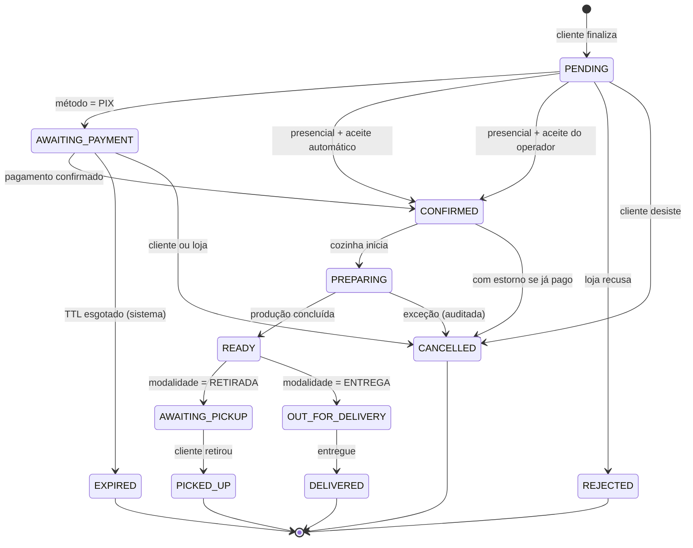
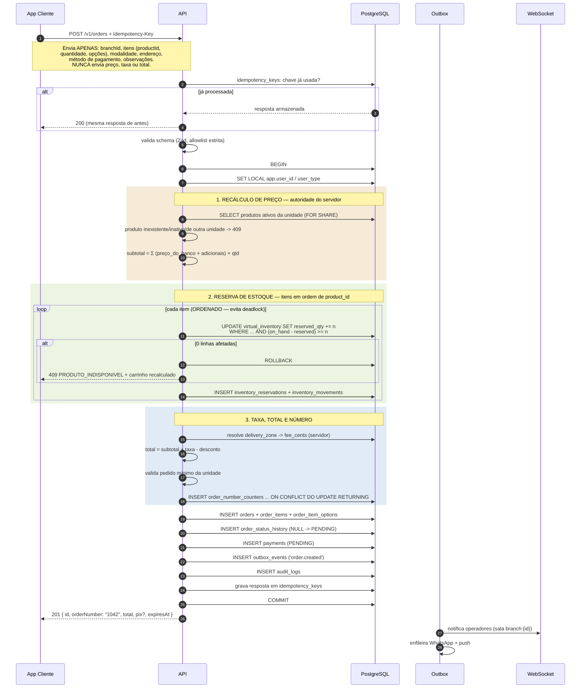
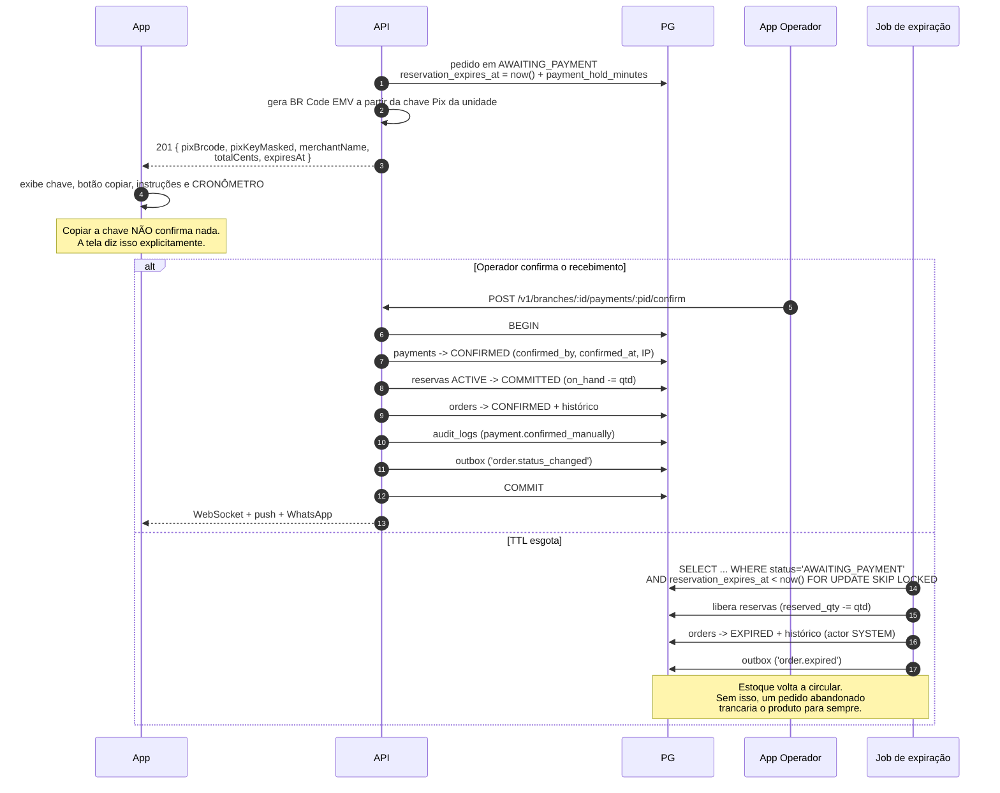

# 04 — Fluxo de Pedido

> Item 5 da Regra Fundamental.

---

## 1. Máquina de estados



Os dois caminhos pedidos no briefing são casos desta máquina:

```
RETIRADA + PIX
PENDENTE → PAGAMENTO PENDENTE → CONFIRMADO → EM PREPARAÇÃO → PRONTO → AGUARDANDO RETIRADA → RETIRADO

ENTREGA + PRESENCIAL
PENDENTE → CONFIRMADO → EM PREPARAÇÃO → PRONTO → EM ROTA → ENTREGUE
```

### Tabela de transições autorizadas

A máquina é **dado**, não `if/else` espalhado. Uma única tabela governa quem pode fazer o quê:

| De | Para | Quem pode | Condição |
|---|---|---|---|
| `PENDING` | `AWAITING_PAYMENT` | SISTEMA | `payment_method = PIX` |
| `PENDING` | `CONFIRMED` | SISTEMA / OPERATOR+ | pagamento presencial; auto-aceite ou aceite manual |
| `PENDING` | `REJECTED` | OPERATOR+ | motivo obrigatório |
| `PENDING` | `CANCELLED` | CUSTOMER | dentro da janela de cancelamento |
| `AWAITING_PAYMENT` | `CONFIRMED` | OPERATOR+ / WEBHOOK | pagamento confirmado (manual hoje, PSP amanhã) |
| `AWAITING_PAYMENT` | `EXPIRED` | SISTEMA | `reservation_expires_at < now()` |
| `AWAITING_PAYMENT` | `CANCELLED` | CUSTOMER / OPERATOR+ | — |
| `CONFIRMED` | `PREPARING` | OPERATOR+ | — |
| `PREPARING` | `READY` | OPERATOR+ | — |
| `READY` | `AWAITING_PICKUP` | OPERATOR+ / SISTEMA | `fulfillment = PICKUP` |
| `READY` | `OUT_FOR_DELIVERY` | OPERATOR+ | `fulfillment = DELIVERY` **e** entregador designado |
| `AWAITING_PICKUP` | `PICKED_UP` | OPERATOR+ | — |
| `OUT_FOR_DELIVERY` | `DELIVERED` | DELIVERY (designado) / OPERATOR+ | — |
| qualquer ativo | `CANCELLED` | UNIT_MANAGER+ | motivo obrigatório; estorno se pago |

Regras estruturais:

- **Estados terminais** (`PICKED_UP`, `DELIVERED`, `CANCELLED`, `REJECTED`, `EXPIRED`) não têm saída.
  Nenhuma. Um pedido entregue jamais volta para "em preparação".
- **Sem pulo de etapa**: `CONFIRMED → READY` direto é rejeitado com `409`.
- Toda transição escreve em `order_status_history` (imutável) **na mesma transação** da mudança.
- Transição não autorizada retorna `403`; transição inválida retorna `409` — a distinção importa para
  diagnosticar e para não vazar informação.

---

## 2. Checkout: a transação crítica



**Tudo dentro de um único `BEGIN…COMMIT`.** Se a reserva do terceiro item falhar, os dois primeiros são
desfeitos pelo `ROLLBACK` — não existe estado intermediário observável, nem estoque preso por um pedido
que não nasceu. É o motivo pelo qual o monolito modular foi escolhido ([ADR-0001](adr/ADR-0001-monolito-modular.md)):
esta transação atravessaria três microsserviços e viraria uma saga com compensação.

### O que o cliente envia — e o que é ignorado

```jsonc
{
  "branchId": "uuid",
  "fulfillment": "DELIVERY",
  "paymentMethod": "PIX",
  "deliveryAddressId": "uuid",
  "customerNotes": "sem cebola",
  "items": [
    { "productId": "uuid", "quantity": 2, "options": ["uuid"], "notes": "bem passado" }
  ],
  "expectedTotalCents": 6480   // OPCIONAL — só para detectar divergência
}
```

Qualquer campo fora deste schema é **rejeitado**, não ignorado (Zod em modo estrito). É a defesa contra
*mass assignment*: enviar `"totalCents": 1`, `"status": "CONFIRMED"` ou `"organizationId": "<outra>"`
resulta em `400`, nunca em um campo aceito por engano.

`expectedTotalCents` merece explicação: **não é usado para cobrar**. Serve só para comparação. Se o preço
mudou entre montar o carrinho e finalizar, a API responde `409` com o carrinho recalculado, e o app pede
confirmação. Sem isso, o cliente seria cobrado um valor diferente do que viu — silenciosamente. É proteção
do consumidor, não fonte de verdade.

---

## 3. Cálculo de valores (sempre no servidor)

```
subtotal      = Σ (preço_do_banco[i] + Σ adicionais_do_banco[i]) × quantidade[i]
taxa_entrega  = 0                                   se PICKUP
              = zona_resolvida(unidade, coordenada) se DELIVERY
desconto      = regras do servidor                  (0 na Fase 1)
total         = subtotal + taxa_entrega - desconto
```

Validações que abortam a transação:

| Verificação | Resposta |
|---|---|
| Produto não pertence à unidade do pedido | `409 PRODUTO_INVALIDO` |
| Produto inativo ou removido | `409 PRODUTO_INDISPONIVEL` |
| Adicional não pertence ao produto | `409 OPCAO_INVALIDA` |
| Grupo obrigatório sem seleção / acima do máximo | `422 SELECAO_INVALIDA` |
| Quantidade fora de 1..999 | `422` |
| `total < min_order_cents` da unidade | `422 PEDIDO_MINIMO` |
| Unidade fechada (`business_hours`) ou pausada | `409 LOJA_FECHADA` |
| Endereço fora de qualquer zona de entrega | `422 FORA_DA_AREA` |
| Método de pagamento não habilitado na unidade | `422 METODO_INDISPONIVEL` |
| Endereço não pertence ao cliente autenticado | `404` (nunca `403` — não confirma existência) |

Os valores gravados são **snapshots**: `order_items.unit_price_cents_snapshot`,
`product_name_snapshot`, `orders.delivery_address_snapshot`. Mudança futura de preço, nome ou endereço
não reescreve o passado.

---

## 4. Pedido com Pix: janela de pagamento



O `payment_hold_minutes` é configurável por unidade (padrão 15 min) porque a tolerância de uma conveniência
e a de um fast-food em pico não são a mesma.

---

## 5. Acompanhamento pelo cliente

| Situação | Canal |
|---|---|
| Tela de acompanhamento aberta | **WebSocket**, sala `order:{id}` — atualização instantânea |
| App em background/fechado | **Push** (FCM/APNs) |
| Redundância | **WhatsApp** (template aprovado), quando há opt-in |
| WebSocket indisponível | *Polling* com backoff (5 s → 30 s) |

Eventos notificados: `CONFIRMED`, `PREPARING`, `READY`, `AWAITING_PICKUP`, `OUT_FOR_DELIVERY`,
`DELIVERED`, `CANCELLED`. Transições internas irrelevantes ao cliente não geram ruído.

O `join` na sala `order:{id}` é **reautorizado no servidor**: só o dono do pedido e operadores com escopo
naquela unidade entram. Sem isso, o WebSocket seria um IDOR com outro nome.

---

## 6. Cancelamento e devolução ao estoque

| Quem | Quando pode | Efeito |
|---|---|---|
| Cliente | Até `PENDING`/`AWAITING_PAYMENT`, ou dentro de `cancellation_window_minutes` após confirmar | Libera reserva; se pago, abre estorno |
| Operador | Até `PREPARING` | Motivo obrigatório; libera/devolve estoque |
| Gerente+ | Qualquer estado ativo | Motivo obrigatório; auditoria reforçada |
| Sistema | `AWAITING_PAYMENT` vencido | `EXPIRED`; libera reserva |

Compensação de estoque conforme o estágio:

- Reserva ainda **`ACTIVE`** → `reserved_qty -= qtd` (movimento `RELEASE`).
- Reserva já **`COMMITTED`** → `on_hand_qty += qtd` (movimento `RESTOCK`), **desde que** o item não tenha
  sido produzido. Se já foi, o operador decide: devolver ao estoque ou registrar perda. A decisão é
  explícita e auditada — o sistema não adivinha o que aconteceu na cozinha.

---

## 7. Idempotência

`POST /v1/orders` exige `Idempotency-Key` (UUID gerado pelo app e mantido durante todas as tentativas).

| Cenário | Resultado |
|---|---|
| Primeira chamada | Processa; grava resposta em `idempotency_keys` |
| Repetição com **mesmo** corpo | Devolve a resposta armazenada — **não** cria segundo pedido |
| Repetição com corpo **diferente** | `422` — chave reutilizada indevidamente |
| Chamada concorrente com a mesma chave | `409 EM_PROCESSAMENTO` (linha travada) |
| Após 24 h | Chave expira |

Resolve o problema real: rede móvel instável, usuário toca "Finalizar" duas vezes, app faz retry
automático após timeout. Sem idempotência, cada um desses vira um pedido duplicado — e um cliente
irritado com duas cobranças.

---

## 8. Eventos emitidos

| Evento | Consumidores |
|---|---|
| `order.created` | WebSocket (operadores), push (operadores), WhatsApp (confirmação ao cliente), métricas |
| `order.status_changed` | WebSocket (cliente + operadores), push, WhatsApp, métricas |
| `order.cancelled` / `order.expired` | Cliente, estoque (compensação), métricas |
| `payment.confirmed` | Cliente, fila da cozinha, conciliação financeira |
| `inventory.sold_out` | Operadores, invalidação do cache de cardápio |

Todos via **outbox transacional** ([`01`, §7](01-arquitetura-do-sistema.md)): o consumidor pode estar fora
do ar sem que o pedido seja afetado.

---

## 9. Desempenho da rota crítica

| Etapa | Alvo (p95) |
|---|---|
| Validação + autorização | < 15 ms |
| Recálculo de preço (produtos em cache) | < 30 ms |
| Reserva de estoque (5 itens) | < 60 ms |
| Persistência do pedido | < 80 ms |
| **Total ponta a ponta** | **< 800 ms** |

O que mantém a transação curta: nenhuma chamada externa dentro dela (Pix, WhatsApp e push são
pós-commit), locks segurados por poucos milissegundos, e itens sempre travados em ordem crescente de
`product_id` — o que elimina deadlock entre dois pedidos com os mesmos produtos em ordens diferentes.
