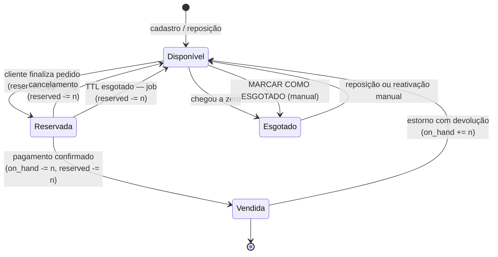
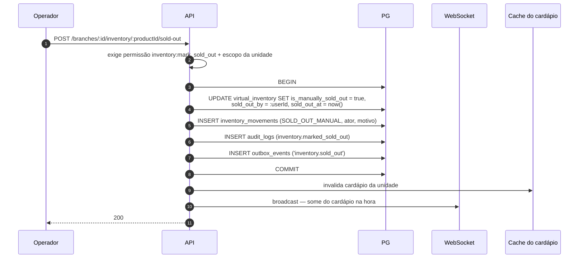
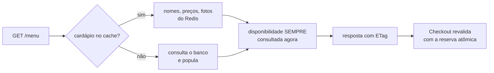

# 05 — Fluxo de Estoque Virtual

> Item 6 da Regra Fundamental. Os invariantes deste documento foram **executados e verificados** contra
> PostgreSQL 16.13 — resultados em [`02-modelo-de-dados.md §15`](02-modelo-de-dados.md#15-validação-executada).

---

## 1. O que é (e o que não é)

Não é estoque contábil. É **disponibilidade de cardápio**: quantas unidades a loja ainda aceita vender
hoje. Não há custo médio, nota de entrada, inventário cíclico ou baixa fiscal.

Três estados de disponibilidade, resolvidos nesta ordem:

```
1. is_manually_sold_out = true          ->  INDISPONÍVEL   (decisão humana vence tudo)
2. mode = 'INFINITE'                    ->  DISPONÍVEL     (não controla quantidade)
3. mode = 'LIMITED' e (on_hand - reserved) > 0 ->  DISPONÍVEL
   caso contrário                       ->  ESGOTADO
```

**Por que `INFINITE` é o padrão:** uma conveniência com 800 SKUs não vai cadastrar quantidade de cada
item. Exigir isso mataria a adoção. O controle de quantidade é opt-in, produto a produto — o lojista liga
para os 15 itens que realmente acabam.

### Os três números

| Campo | Significado | Quem altera |
|---|---|---|
| `on_hand_qty` | O que a loja tem para vender | Operador (ajuste/reposição) e confirmação de pedido |
| `reserved_qty` | Preso em pedidos ainda não concluídos | Sistema (reserva/liberação) |
| *disponível* | `on_hand_qty - reserved_qty` — **derivado, nunca armazenado** | — |

Armazenar "disponível" criaria uma terceira fonte de verdade para divergir das outras duas. Ele é sempre
calculado.

---

## 2. Ciclo de vida de uma unidade



O passo `Reservada → Vendida` acontece na **confirmação do pagamento**, não na criação do pedido. Antes
disso a unidade está apenas *presa* — e volta a circular sozinha se o pagamento não vier.

---

## 3. A operação atômica

Esta é a única linha de SQL que impede dois clientes de comprarem a mesma última unidade:

```sql
UPDATE virtual_inventory
   SET reserved_qty = reserved_qty + $3,
       updated_at   = now()
 WHERE branch_id  = $1
   AND product_id = $2
   AND mode = 'LIMITED'
   AND is_manually_sold_out = false
   AND (on_hand_qty - reserved_qty) >= $3
RETURNING on_hand_qty - reserved_qty AS remaining;
```

`0 linhas afetadas` = sem estoque → `409` e `ROLLBACK` do pedido inteiro.

### Por que funciona sem `SELECT … FOR UPDATE`

Em `READ COMMITTED` (padrão do PostgreSQL), quando duas transações atualizam a **mesma linha**, a segunda
bloqueia até a primeira comitar e então **reavalia a cláusula `WHERE` contra a versão nova** da linha
(mecanismo *EvalPlanQual*). Se o estoque acabou nesse intervalo, o `WHERE` passa a ser falso e o `UPDATE`
afeta zero linhas.

O anti-padrão que isso evita:

```sql
-- ERRADO — lost update clássico
SELECT on_hand_qty - reserved_qty FROM virtual_inventory WHERE ...;  -- ambos leem 1
-- ... aplicação decide "tem estoque" ...
UPDATE virtual_inventory SET reserved_qty = reserved_qty + 1 WHERE ...;  -- ambos gravam
-- Resultado: 2 vendas, 1 unidade.
```

O erro está em decidir **fora** do banco e gravar depois. A versão correta decide **dentro** do mesmo
statement que grava.

> **Atenção operacional:** em `REPEATABLE READ` ou `SERIALIZABLE` este mesmo statement levanta erro de
> serialização em vez de reavaliar. A transação de checkout **deve** rodar em `READ COMMITTED` — ou tratar
> o retry explicitamente. Está documentado aqui porque é o tipo de detalhe que alguém muda por engano
> seis meses depois.

### Rede de segurança no schema

```sql
CONSTRAINT virtual_inventory_reserved_chk CHECK (reserved_qty <= on_hand_qty)
```

Mesmo que a consulta acima fosse reescrita errado no futuro, o banco recusa a transação. **Verificado:**
tentativa de reservar 11 de 10 unidades falha com
`violates check constraint "virtual_inventory_reserved_chk"`.

### Prevenção de deadlock

Um pedido com os itens `[B, A]` e outro com `[A, B]` travariam um ao outro. Solução: **os itens são
sempre processados em ordem crescente de `product_id`**. Ordem total consistente ⇒ deadlock impossível.

---

## 4. Confirmação, liberação e expiração

```sql
-- COMMIT: pagamento confirmado — a unidade sai de vez
UPDATE virtual_inventory
   SET on_hand_qty  = on_hand_qty  - $3,
       reserved_qty = reserved_qty - $3
 WHERE id = $1 AND reserved_qty >= $3;

-- RELEASE: cancelamento ou expiração — a unidade volta a circular
UPDATE virtual_inventory
   SET reserved_qty = reserved_qty - $3
 WHERE id = $1 AND reserved_qty >= $3;
```

A condição `reserved_qty >= $3` torna as duas operações **idempotentes**: rodar duas vezes por engano
(retry de worker, job duplicado) não produz número negativo nem estoque fantasma.

### Job de expiração

```sql
SELECT r.* FROM inventory_reservations r
 WHERE r.status = 'ACTIVE' AND r.expires_at < now()
 ORDER BY r.expires_at
 FOR UPDATE SKIP LOCKED
 LIMIT 100;
```

Roda a cada 30 s. `SKIP LOCKED` permite vários workers em paralelo sem processar a mesma reserva.
Sem este job, um pedido Pix abandonado trancaria o produto **para sempre** — é o risco de maior
probabilidade do sistema ([`00` §9](00-analise-arquitetural.md)).

---

## 5. "MARCAR COMO ESGOTADO"

Requisito explícito do briefing, com uma decisão de modelagem importante: **o esgotamento manual é
independente da quantidade**.

"Acabou a maionese, não consigo montar o X-Burger" não é o mesmo fato que "cheguei a zero unidades".
Se a ação manual apenas zerasse `on_hand_qty`, a informação de quantas unidades existiam seria perdida e
o operador teria que reinventar um número ao reativar.



Reativação é o caminho inverso (`is_manually_sold_out = false`, `reactivated_by`, `reactivated_at`,
movimento `REACTIVATE`) e registra igualmente quem e quando — como pedido no briefing.

**Pedidos já reservados não são afetados.** Marcar como esgotado impede vendas **novas**; quem já pagou
tem o pedido preservado. Cancelar pedido pago exige ação explícita do operador, com motivo.

---

## 6. O razão de movimentos

Toda alteração escreve uma linha imutável em `inventory_movements` com o estado **resultante**:

| Tipo | Quando | `quantity_delta` |
|---|---|---|
| `RESERVE` | Pedido criado | `+n` em reservado |
| `COMMIT` | Pagamento confirmado | `-n` em disponível |
| `RELEASE` | Cancelamento | `-n` em reservado |
| `EXPIRE_RELEASE` | TTL esgotado (sistema) | `-n` em reservado |
| `RESTOCK` | Reposição ou estorno com devolução | `+n` |
| `MANUAL_ADJUST` | Correção do operador | `±n` (motivo obrigatório) |
| `SOLD_OUT_MANUAL` / `REACTIVATE` | Ação manual | `0` |
| `RECONCILE` | Correção pela rotina de conferência | `±n` |

Como cada linha guarda `on_hand_after` e `reserved_after`, o saldo pode ser **reconstruído por replay** e
comparado com o valor corrente. Um job diário faz essa conferência e alerta em divergência — que sempre
indica bug, e nunca deve ser corrigida em silêncio.

`UPDATE` e `DELETE` são bloqueados por trigger. **Verificado** em `order_status_history`, mesmo mecanismo:
*"append-only: UPDATE não é permitido"*.

---

## 7. Concorrência: resultados medidos

Testes executados contra PostgreSQL 16.13 real, com processos paralelos de verdade
([`sql/validation-tests.sql`](sql/validation-tests.sql)):

| Cenário | Esperado | **Obtido** |
|---|---|---|
| 1 unidade, **40 clientes simultâneos** | 1 venda | **1 venda** |
| 10 unidades, **60 clientes simultâneos** | 10 vendas | **10 vendas** (`on_hand=10 / reserved=10`) |
| Reservar 11 de 10 | Recusado | Recusado pela `CHECK` |
| 50 pedidos simultâneos gerando número | 50 números únicos | **50 números, 50 distintos** |

Estes testes precisam ser **bloqueantes no CI**. É o tipo de garantia que se perde silenciosamente numa
refatoração e só reaparece como reclamação de cliente num sábado à noite.

---

## 8. Consistência entre cardápio e disponibilidade

O cardápio é cacheado (5 min); **a disponibilidade não é**. Motivo: cachear estoque produz *overselling
visível* — o cliente monta o carrinho com base em dado velho e leva `409` no checkout.



Três camadas de verdade, em ordem crescente de autoridade: **cache** (cosmético) → **leitura ao vivo**
(informativo) → **reserva atômica no checkout** (decisão final). O app pode se enganar; a transação, não.

Invalidação do cache do cardápio: alteração de produto/preço/categoria, mudança de `is_manually_sold_out`,
e transição de disponível ↔ esgotado por quantidade.

---

## 9. Alertas operacionais

| Situação | Ação |
|---|---|
| `on_hand - reserved <= low_stock_threshold` | Push ao operador: "restam 3 X-Burgers" |
| Chegou a zero | Notificação + produto sai do cardápio automaticamente |
| Reserva ativa há mais de 2× o TTL | Alerta técnico — indica falha no job de expiração |
| Divergência entre razão e saldo | Alerta crítico — indica bug de concorrência |
| Ajuste manual acima de um limite | Notifica o gerente da unidade (controle antifraude interno) |

---

## 10. Integridade contra manipulação

| Vetor | Mitigação |
|---|---|
| Cliente altera quantidade no app | Servidor valida `1..999` e recalcula tudo; o app não decide nada |
| Cliente pede produto de outra unidade | `products.branch_id` conferido contra o `branch_id` do pedido |
| Cliente força compra de item esgotado | Reserva atômica falha → `409`; disponibilidade nunca vem do cliente |
| Operador zera estoque para "sumir" com vendas | Todo ajuste é auditado com ator, motivo e valor anterior |
| Concorrência gera overselling | `UPDATE` condicional + `CHECK` + testes bloqueantes no CI |
| Requisições em massa para esgotar concorrente | Rate limit por cliente/IP + expiração de reserva devolve o estoque |
| Operador de outra unidade altera este estoque | Guard de escopo + RLS — **verificado**: 0 linhas visíveis entre franquias |

O princípio que amarra tudo: **o app do cliente informa intenção; o banco decide o resultado.**
