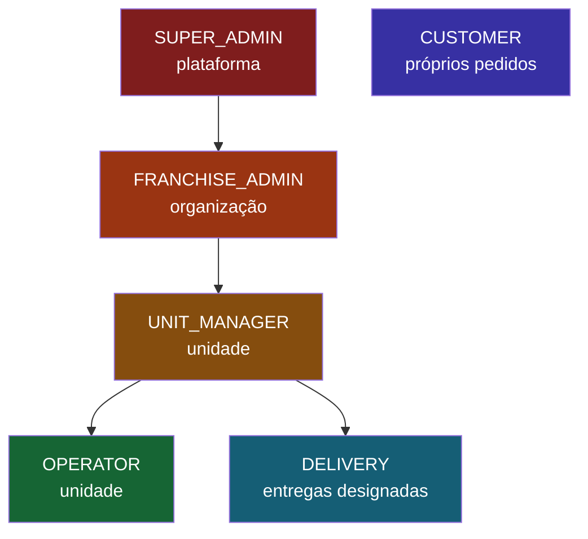
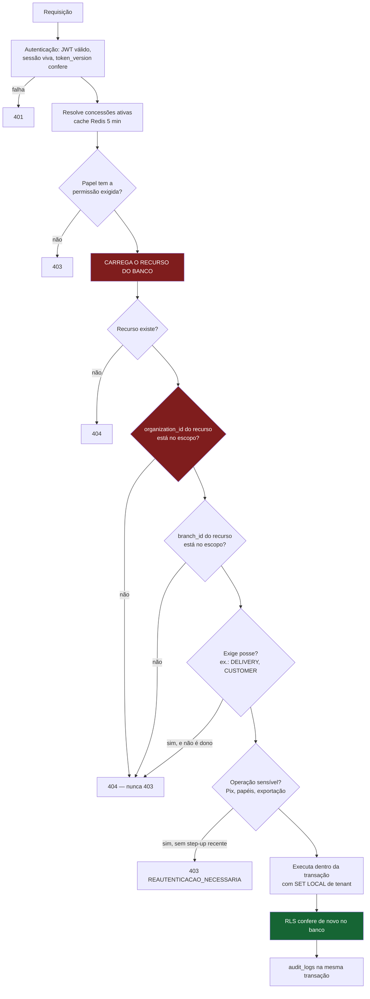

# 06 — Modelo de Permissões

> Item 7 da Regra Fundamental.

---

## 1. Duas perguntas independentes

Autorização aqui responde **duas** perguntas separadas, e confundi-las é a origem da maior parte das
falhas de IDOR/BOLA em sistemas multi-tenant:

| Pergunta | Mecanismo | Exemplo de falha se ausente |
|---|---|---|
| **O quê?** Este papel pode executar esta ação? | RBAC (papel → permissões) | Operador altera preço |
| **Onde?** Este usuário alcança este recurso? | Escopo (organização → unidade → recurso) | Gerente da unidade A altera o cardápio da unidade B |

Um sistema que só verifica a primeira tem RBAC funcionando e vazamento de tenant garantido. As duas
verificações são obrigatórias, sempre, e o banco confere de novo por RLS.

---

## 2. Hierarquia de papéis



| Papel | Nível | Escopo | Responsabilidade |
|---|---|---|---|
| `SUPER_ADMIN` | 0 | Plataforma | Operação da plataforma. **Não** é usado no dia a dia; todo acesso a dados de cliente é auditado e alertado |
| `FRANCHISE_ADMIN` | 1 | Uma organização | Cria unidades, define política da rede, vê relatórios consolidados |
| `UNIT_MANAGER` | 2 | Uma ou mais unidades | Catálogo, preços, operadores, configurações e chave Pix da unidade |
| `OPERATOR` | 3 | Uma ou mais unidades | Recebe pedidos, avança status, marca esgotado, confirma pagamento |
| `DELIVERY` | 4 | Entregas designadas a ele | Vê e atualiza **apenas** as próprias entregas |
| `CUSTOMER` | 5 | Os próprios dados | Compra e acompanha |

`CUSTOMER` fica fora da hierarquia: é um usuário da plataforma, não da franquia.

**Regra de escalonamento:** um usuário só concede papéis de **nível estritamente maior** que o seu.
Um `UNIT_MANAGER` (2) cria `OPERATOR` (3) e `DELIVERY` (4), nunca outro `UNIT_MANAGER` nem
`FRANCHISE_ADMIN`. Isso fecha a via mais comum de *privilege escalation*: quem administra usuários
promovendo a si mesmo.

---

## 3. Matriz papel × permissão

`✔` concedido · `—` negado · `※` restrito ao próprio recurso

| Permissão | SUPER | FRANCHISE | MANAGER | OPERATOR | DELIVERY | CUSTOMER |
|---|:--:|:--:|:--:|:--:|:--:|:--:|
| `organization:read` | ✔ | ✔ | — | — | — | — |
| `organization:update` | ✔ | ✔ | — | — | — | — |
| `branch:create` | ✔ | ✔ | — | — | — | — |
| `branch:read` | ✔ | ✔ | ✔ | ✔ | ✔ | — |
| `branch:update` | ✔ | ✔ | ✔ | — | — | — |
| `branch:archive` | ✔ | ✔ | — | — | — | — |
| `user:create` | ✔ | ✔ | ✔ | — | — | — |
| `user:read` | ✔ | ✔ | ✔ | — | — | ※ |
| `user:update` | ✔ | ✔ | ✔ | — | — | ※ |
| `user:deactivate` | ✔ | ✔ | ✔ | — | — | — |
| `role:assign` | ✔ | ✔ | ✔ | — | — | — |
| `role:revoke` | ✔ | ✔ | ✔ | — | — | — |
| `product:create` | ✔ | ✔ | ✔ | — | — | — |
| `product:read` | ✔ | ✔ | ✔ | ✔ | — | público |
| `product:update` | ✔ | ✔ | ✔ | — | — | — |
| `product:delete` | ✔ | ✔ | ✔ | — | — | — |
| **`price:update`** | ✔ | ✔ | ✔ | **—** | — | — |
| `category:manage` | ✔ | ✔ | ✔ | — | — | — |
| `inventory:read` | ✔ | ✔ | ✔ | ✔ | — | — |
| `inventory:adjust` | ✔ | ✔ | ✔ | ✔ | — | — |
| **`inventory:mark_sold_out`** | ✔ | ✔ | ✔ | **✔** | — | — |
| `order:read` | ✔ | ✔ | ✔ | ✔ | ※ | — |
| `order:read_own` | — | — | — | — | — | ✔ |
| `order:create` | — | — | — | — | — | ✔ |
| `order:transition` | ✔ | ✔ | ✔ | ✔ | ※ | — |
| `order:cancel` | ✔ | ✔ | ✔ | ✔ | — | ※ |
| `order:refund` | ✔ | ✔ | ✔ | — | — | — |
| `payment:read` | ✔ | ✔ | ✔ | ✔ | — | ※ |
| **`payment:confirm`** | ✔ | ✔ | ✔ | **✔** | — | — |
| `pix_settings:read` | ✔ | ✔ | ✔ | — | — | — |
| **`pix_settings:update`** | ✔ | ✔ | ✔ ⚠ | **—** | — | — |
| `delivery:read` | ✔ | ✔ | ✔ | ✔ | ※ | — |
| `delivery:assign` | ✔ | ✔ | ✔ | ✔ | — | — |
| `delivery:update_own` | — | — | — | — | ✔ | — |
| `settings:read` | ✔ | ✔ | ✔ | ✔ | — | — |
| `settings:update` | ✔ | ✔ | ✔ | — | — | — |
| `branding:update` | ✔ | ✔ | ✔ | — | — | — |
| `audit:read` | ✔ | ✔ | ✔ | — | — | — |
| `report:read` | ✔ | ✔ | ✔ | — | — | — |
| `whatsapp:configure` | ✔ | ✔ | — | — | — | — |

⚠ `pix_settings:update` pelo `UNIT_MANAGER` exige **reautenticação (step-up)** e gera alerta ao
`FRANCHISE_ADMIN`. É a alteração de maior impacto financeiro do sistema: quem troca a chave Pix redireciona
todo o dinheiro que entra. Tratá-la como uma edição comum de configuração seria o erro mais caro possível.

### Três escolhas que merecem justificativa

1. **`OPERATOR` confirma pagamento mas não altera preço.** Quem está no balcão precisa destravar o pedido
   de quem acabou de pagar por Pix — sem isso o fluxo trava na fila. Já alterar preço não tem nenhuma
   razão operacional em tempo real, e é o caminho direto para fraude. Toda confirmação registra ator, IP e
   horário, e existe relatório de divergência.
2. **`OPERATOR` marca esgotado mas não altera quantidade sem registro.** Ambas as ações são permitidas
   (`inventory:adjust` e `inventory:mark_sold_out`) porque a realidade da loja muda a cada minuto — mas
   ajuste manual exige motivo e dispara alerta ao gerente acima de um limite configurável.
3. **`DELIVERY` só enxerga o que lhe foi designado.** Um entregador não lista os pedidos da loja: vê
   apenas as entregas em que `deliveries.courier_user_id = <ele>`. Isso é verificação de **posse**, não
   de papel, e roda no backend.

---

## 4. Escopo: como o alcance é resolvido

`user_roles` sempre carrega o escopo da concessão:

| `organization_id` | `branch_id` | Significado |
|---|---|---|
| `NULL` | `NULL` | Plataforma (apenas `SUPER_ADMIN`) |
| definido | `NULL` | **Toda** a organização (`FRANCHISE_ADMIN`) |
| definido | definido | **Apenas aquela unidade** (`UNIT_MANAGER`, `OPERATOR`, `DELIVERY`) |

Um usuário pode ter várias concessões: `OPERATOR` na unidade Centro **e** na unidade Shopping. O escopo
efetivo é a união.

### A "permissão administrativa explícita" do briefing

O requisito diz que um operador não acessa outra unidade *sem permissão administrativa explícita*. Isso é
exatamente uma **nova linha em `user_roles`**, concedida por quem tem `role:assign`, e opcionalmente
**temporária** via `expires_at`:

```sql
INSERT INTO user_roles (user_id, role_id, organization_id, branch_id, granted_by, expires_at)
VALUES (:operador, :papel_operator, :org, :outra_unidade, :gerente, now() + interval '8 hours');
```

Um job desativa concessões vencidas. Não existe "modo administrador temporário" implícito, nem flag
global: acesso entre unidades é sempre um registro nomeado, com autor, com prazo e auditado.

---

## 5. Algoritmo de autorização

Executado em **toda** requisição autenticada, sem exceção:



Dois detalhes decidem a segurança do conjunto:

**O recurso é carregado do banco antes de autorizar.** Nunca se confia no `branchId` da URL. O caminho
`/branches/:branchId/orders/:orderId` existe para clareza e cache — mas a autoridade é
`orders.branch_id` lido do banco. Se divergirem, é `404`.

**Recurso fora do escopo devolve `404`, não `403`.** Um `403` confirma que o recurso existe — e permite
enumerar os pedidos de uma franquia concorrente pela diferença entre as respostas. `404` não vaza nada.
`403` fica reservado a "existe, você alcança, mas seu papel não permite esta ação".

---

## 6. Onde a autorização vive no código

```typescript
@Controller('v1/branches/:branchId/products')
export class ProductsController {

  @Patch(':id')
  @RequirePermission('price:update')      // 1. RBAC declarativo
  @ScopedTo('branch')                     // 2. escopo obrigatório
  @StepUpRequired({ maxAgeMinutes: 5 })   // 3. reautenticação
  @Audited('product.price_updated')       // 4. auditoria automática
  async updatePrice(
    @Param('id') id: string,
    @Body() dto: UpdatePriceDto,          // 5. Zod estrito — sem mass assignment
    @Ctx() ctx: TenantContext,
  ) {
    // O caso de uso recebe o contexto de tenant já validado.
    // A transação abre com SET LOCAL — a RLS confere pela terceira vez.
    return this.updatePriceUseCase.execute({ productId: id, ...dto }, ctx);
  }
}
```

**Negação por padrão, garantida estruturalmente:** um guard global exige que toda rota declare
`@RequirePermission` ou `@Public`. Rota sem decorador **não compila** — um teste de arquitetura enumera
os handlers registrados e falha o build. Esquecer de proteger um endpoint deixa de ser possível por
distração; vira um erro de build.

---

## 7. Cache de permissões e revogação

| Aspecto | Decisão |
|---|---|
| Onde | Redis, chave `perms:{user_id}:{token_version}` |
| TTL | 5 min |
| Invalidação | Conceder/revogar papel apaga a chave; troca de senha ou logout global incrementa `token_version`, tornando toda chave antiga inalcançável |
| Pior caso | 5 min de permissão obsoleta em cenário benigno; **zero** em revogação explícita, que é o cenário que importa |

Incluir `token_version` na chave é o que torna a revogação instantânea sem varrer o Redis.

---

## 8. Casos de negação (comportamento esperado)

| Cenário | Resultado |
|---|---|
| `OPERATOR` chama `PATCH /products/:id` com novo preço | `403` — falta `price:update` |
| `UNIT_MANAGER` da unidade A abre pedido da unidade B | `404` |
| Cliente troca o ID na URL para ver pedido alheio | `404` |
| Cliente envia `"totalCents": 1` no corpo | `400` — campo não previsto no schema |
| `DELIVERY` lista todos os pedidos da unidade | `403` |
| `DELIVERY` atualiza entrega designada a outro | `404` |
| `UNIT_MANAGER` tenta criar outro `UNIT_MANAGER` | `403` — nível hierárquico |
| `OPERATOR` troca a chave Pix | `403` |
| `UNIT_MANAGER` troca a chave Pix sem MFA recente | `403 REAUTENTICACAO_NECESSARIA` |
| `FRANCHISE_ADMIN` acessa outra organização | `404` (e RLS retornaria vazio de qualquer forma) |
| Token válido, papel revogado há 10 s | `403` — cache invalidado na revogação |
| Papel com `expires_at` vencido | `403` — concessões vencidas não são carregadas |

---

## 9. Testes obrigatórios de autorização

Bloqueantes no CI:

1. **Matriz completa**: para cada rota × cada papel, o resultado esperado é declarado e verificado.
   Nova rota sem entrada na matriz **falha o build**.
2. **Isolamento entre tenants**: dois tenants populados; cada rota é chamada com credencial do tenant
   errado e **precisa** retornar `404`/vazio. *(A camada equivalente no banco já foi verificada — ver
   [`02` §15](02-modelo-de-dados.md#15-validação-executada): mesma consulta, sem `WHERE`, retorna 0 linhas
   para o tenant errado.)*
3. **Cobertura de decoradores**: nenhuma rota sem `@RequirePermission` ou `@Public`.
4. **Escalonamento de privilégio**: cada papel tenta conceder papel de nível igual ou superior; todas
   devem falhar.
5. **Mass assignment**: cada DTO recebe campos extras (`role`, `organizationId`, `totalCents`, `status`)
   e precisa rejeitar.
6. **Cobertura de RLS**: `app.assert_rls_coverage()` — **já falhou uma vez** durante a elaboração desta
   arquitetura, apontando `user_roles` e `product_modifier_groups` sem política. É a prova de que o teste
   ganha o lugar dele no pipeline.
