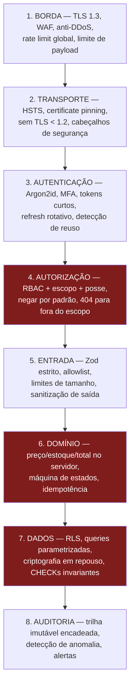

# 07 — Estratégia de Segurança

> Item 8 da Regra Fundamental. O catálogo de ameaças e mitigações ponto a ponto está em
> [`09-ameacas-e-mitigacoes.md`](09-ameacas-e-mitigacoes.md); aqui está a **estratégia** que o organiza.

---

## 1. Princípios

1. **Defesa em profundidade.** Nenhum controle é único ponto de falha. Isolamento de tenant é verificado
   na aplicação **e** no banco. Validação acontece no app (UX) **e** no servidor (segurança) — e só a do
   servidor conta.
2. **Negar por padrão.** Rota sem permissão declarada não compila. Campo fora do schema é rejeitado.
   Origem não listada no CORS é bloqueada.
3. **O cliente é hostil.** Não porque o usuário seja mal-intencionado, mas porque o app roda em
   dispositivo controlado por terceiros. Todo dado vindo dele é entrada não confiável.
4. **Falhar fechado.** Redis fora do ar não desliga o rate limit — restringe. Erro na resolução de
   permissão nega. Assinatura de webhook não verificável rejeita.
5. **Segurança é testável.** Cada controle relevante tem teste automatizado. Controle sem teste é
   intenção, não garantia.
6. **Mínimo privilégio em toda camada.** Papel de banco sem `UPDATE` em tabela de auditoria; container sem
   root; bucket privado; secret por ambiente.

---

## 2. Camadas de controle



As camadas 4, 6 e 7 são as que carregam o risco específico deste produto: isolamento entre franquias,
integridade financeira e integridade de estoque.

---

## 3. Segurança do aplicativo mobile

O app é **software público**. Qualquer pessoa baixa o APK, descompila e lê tudo o que está lá.

| Controle | Implementação |
|---|---|
| **Zero segredos no bundle** | Nenhuma chave de API, credencial de PSP, token de WhatsApp ou segredo de assinatura. Nem em variável de ambiente do build — `EXPO_PUBLIC_*` é público, o nome não é decorativo |
| Armazenamento de token | Keychain/Keystore via `expo-secure-store`; access token só em memória |
| Certificate pinning | Pin da CA intermediária (não da folha) com pino de backup, para não quebrar o app na renovação |
| Detecção de root/jailbreak | Sinal de risco enviado à API — restringe operações sensíveis, **não** bloqueia o app (contorno é trivial; usar como bloqueio dá falsa confiança) |
| Attestation | **Play Integrity** e **App Attest** em rotas sensíveis (criação de pedido, OTP) para separar app legítimo de script |
| Anti-screenshot | Desativa captura nas telas de pagamento (`FLAG_SECURE` / blur no iOS) |
| Teclado | `secureTextEntry` sem autocorreção/sugestão em campos de senha e OTP |
| Deep links | Validados e assinados (App Links / Universal Links verificados) — evita sequestro de link |
| Ofuscação | Hermes + ProGuard/R8. Dificulta engenharia reversa; **não** é controle de segurança |
| Logs em produção | Removidos no build de release (`babel-plugin-transform-remove-console`) |
| Dependências | `npm audit` + Snyk no CI; lockfile obrigatório; sem instalação de script pós-install não revisado |
| Atualização forçada | Versão mínima suportada exigida pela API — permite desativar cliente com falha conhecida |

**Regra que resume tudo:** se um controle pode ser removido editando o app, ele **não é** controle de
segurança — é experiência do usuário. Validação de preço, disponibilidade e permissão vivem no servidor.

---

## 4. Segurança da API

### Entrada

- **Zod em modo estrito**: campo não declarado causa `400`. É a defesa estrutural contra *mass assignment*.
- **Allowlist, nunca blocklist**: enumeramos o que é permitido; tentar enumerar o que é proibido sempre
  falha contra a variação seguinte.
- **Limites**: corpo ≤ 256 KB, arrays com máximo declarado, strings com tamanho máximo, profundidade de
  JSON limitada (proteção contra *JSON bomb*), `limit` de paginação ≤ 100.
- **Coerção explícita**: nada de coerção implícita de tipo; `"1e10"` não vira quantidade.
- **UUID validado** antes de tocar o banco.

### Saída

- Serializadores explícitos por rota (`@Expose`): campo novo no modelo **não** vaza por padrão na resposta.
- `password_hash`, `refresh_token_hash`, `key_encrypted` e `*_secret_ref` nunca aparecem em DTO.
- Erros em produção sem *stack trace*, sem SQL, sem nome de tabela — apenas `code` + `traceId`.
- Chave Pix exibida mascarada (`•••1234`), completa apenas na tela de pagamento do pedido correspondente.

### Cabeçalhos

```
Strict-Transport-Security: max-age=63072000; includeSubDomains; preload
Content-Security-Policy: default-src 'none'; frame-ancestors 'none'
X-Content-Type-Options: nosniff
X-Frame-Options: DENY
Referrer-Policy: no-referrer
Cache-Control: no-store            (rotas autenticadas)
Permissions-Policy: geolocation=(), camera=(), microphone=()
```

### CORS

Origens explicitamente listadas (painel admin e domínio da vitrine). **Nunca** `*` com credenciais.
O app mobile não usa CORS — nem por isso a política é relaxada.

### Rate limiting

| Rota | Limite |
|---|---|
| `POST /auth/login` | 5 / 15 min por conta · 10 / min por IP |
| `POST /auth/otp/request` | 1 / min, 5 / h por telefone · limite por IP e faixa /24 |
| `POST /auth/refresh` | 60 / h por sessão |
| `POST /orders` | 10 / min por cliente · 100 / min por unidade |
| `POST /payments/*/confirm` | 30 / min por operador |
| Leitura pública de cardápio | 120 / min por IP (com cache de borda) |
| Global autenticado | 300 / min por usuário |

Janela deslizante no Redis. **Falha fechada**: Redis indisponível ativa limite conservador em memória por
instância. Resposta sempre com `Retry-After`, e nunca revelando por que o limite foi atingido.

---

## 5. Segurança de dados

### Em trânsito
TLS 1.3 (mínimo 1.2), cifras modernas, HSTS com preload. TLS também **dentro** da VPC: banco, Redis e
serviços internos com conexão cifrada — a rede interna não é considerada confiável.

### Em repouso

| Dado | Proteção |
|---|---|
| Volume do banco / backups | Cifrados com KMS; PITR habilitado |
| Senha | Argon2id + salt + pepper (HMAC com chave em KMS, aplicado antes do hash) |
| Chave Pix | Envelope encryption com KMS; só os 4 últimos dígitos em claro |
| CNPJ/CPF | Cifrados; busca por HMAC determinístico, nunca pelo valor em claro |
| Segredo TOTP | Cifrado com KMS |
| Refresh token | Somente SHA-256 |
| Token de WhatsApp/PSP | **Fora do banco** — apenas referência ao secret manager |
| Imagens | Bucket privado, acesso por URL assinada de curta duração |

O pepper merece destaque: um vazamento **apenas do banco** (o cenário mais comum — SQL injection, backup
exposto, réplica mal configurada) não permite ataque offline às senhas, porque falta uma chave que nunca
esteve no banco.

### Gestão de segredos

- AWS Secrets Manager / Parameter Store, com rotação automática onde o provedor suporta.
- **Nenhum segredo em `.env` versionado, imagem Docker, log ou variável de build do mobile.**
- Acesso por *IAM role* da task, não por credencial estática.
- Varredura de segredos no CI (gitleaks) e no histórico do repositório.
- Procedimento de rotação documentado e **ensaiado**: chave de JWT, credencial de banco, token de WhatsApp.

---

## 6. Upload de arquivos

Uma das superfícies mais perigosas, tratada com sete controles em série:

```mermaid
sequenceDiagram
    participant App
    participant API
    participant S3
    participant W as Worker

    App->>API: POST /uploads/presign { contentType, byteSize }
    API->>API: 1. permissão + escopo
    API->>API: 2. allowlist de tipo (jpeg/png/webp) e tamanho (<= 5 MB)
    API->>API: 3. gera storage_key = UUID<br/>(nome do usuário NUNCA é usado)
    API->>S3: URL assinada, expira em 5 min,<br/>content-type e tamanho fixados na assinatura
    API-->>App: { uploadUrl, storageKey }
    App->>S3: PUT direto (não passa pela API)
    App->>API: POST /uploads/confirm { storageKey }
    API->>W: enfileira processamento
    W->>S3: baixa
    W->>W: 4. verifica MAGIC BYTES (não confia no content-type)
    W->>W: 5. reprocessa com sharp -> remove EXIF, polyglots e payload embutido
    W->>W: 6. gera miniaturas + blurhash
    W->>W: 7. antivírus (ClamAV)
    W->>S3: grava versão sanitizada; descarta o original
```

| Ameaça | Controle |
|---|---|
| Path traversal (`../../etc/passwd`) | Nome do usuário nunca é usado — chave é UUID gerado no servidor |
| Web shell / arquivo polyglot | Reprocessamento com `sharp`: a imagem é **reescrita**, não inspecionada |
| SVG com JavaScript | SVG fora da allowlist |
| Content-type mentiroso | Verificação de magic bytes no servidor |
| Zip bomb / imagem gigante | Limite de bytes e de dimensões antes de decodificar |
| Vazamento de geolocalização por EXIF | Metadados removidos no reprocessamento |
| XSS pelo domínio principal | Mídia servida por domínio separado, `Content-Disposition` e `nosniff` |
| Upload sem vínculo (lixo) | `media_assets.is_confirmed`; job remove órfãos após 24 h |
| Malware | Varredura antes de publicar |

---

## 7. SSRF

Regra base: **o backend não busca URL fornecida por usuário.** Onde for inevitável (futuro import de
logo por URL, webhook de saída configurável):

- Allowlist de domínios; nunca blocklist.
- Resolução de DNS **antes** da requisição, com bloqueio de faixas privadas, loopback, link-local e
  `169.254.169.254` (metadados da nuvem).
- Proteção contra *DNS rebinding*: resolve, valida e conecta ao **IP validado**.
- Redirecionamentos desabilitados.
- Timeout curto, tamanho máximo de resposta, sem repasse da resposta bruta ao cliente.
- Egresso da VPC restrito por security group — mesmo com falha de código, a rede recusa.
- **IMDSv2 obrigatório** nas instâncias: o vetor clássico "SSRF → credencial de IAM" exige token PUT.

---

## 8. Auditoria

### O que é registrado

Cobre integralmente o §10 do briefing: login, logout, tentativa inválida, troca de senha, alteração de
permissões, criação/exclusão de produto, alteração de preço, alteração de estoque, produto esgotado,
pedido criado/alterado/cancelado, mudança de status, alteração de Pix e mudanças administrativas.

Cada registro guarda: `actor_user_id`, `organization_id`, `branch_id`, `action`, `resource_type`,
`resource_id`, `result`, `timestamp`, `ip_address`, `user_agent`, `request_id` e `metadata`.

### Como é protegido

| Propriedade | Mecanismo |
|---|---|
| Imutabilidade | Trigger bloqueia `UPDATE`/`DELETE` (**verificado**) + `REVOKE` desses privilégios do papel da aplicação |
| Detecção de adulteração | Cadeia de hash: `record_hash = SHA-256(prev_hash ‖ conteúdo canônico)`, por organização; job diário confere a cadeia |
| Atomicidade | Escrito **na mesma transação** do fato — não existe operação sensível sem trilha |
| Privacidade | `metadata` passa por redação: sem senha, token, chave Pix completa ou CPF |
| Retenção | 12 meses quente, 5 anos em arquivo frio |
| Exportação | `FRANCHISE_ADMIN` exporta a trilha da própria organização (exportação também é auditada) |

### Alertas automáticos

Múltiplas falhas de login na mesma organização · reuso de refresh token detectado · alteração de chave Pix
· concessão de papel administrativo · confirmação manual de pagamento fora do horário de funcionamento ·
ajuste de estoque acima do limite · acesso de `SUPER_ADMIN` a dados de organização · divergência na cadeia
de hash · pico anormal de cancelamentos.

---

## 9. Segurança no ciclo de desenvolvimento

| Fase | Controle |
|---|---|
| Design | Modelagem de ameaças por fluxo novo (STRIDE) — ver [`09`](09-ameacas-e-mitigacoes.md) |
| Código | Revisão obrigatória; `CODEOWNERS` para auth, pagamentos e RLS |
| CI (bloqueante) | SAST (Semgrep/CodeQL), SCA de dependências, gitleaks, testes de autorização, testes de isolamento de tenant, teste de concorrência de estoque, `assert_rls_coverage()` |
| Build | Imagem sem root, base mínima, SBOM, assinatura de artefato |
| Deploy | Sem acesso humano a produção por padrão; acesso de emergência com aprovação e gravação |
| Runtime | Detecção de anomalia, alertas de SLO, WAF em modo bloqueio |
| Periódico | DAST em staging; **pentest externo anual** e a cada mudança estrutural |
| Dependências | Renovate com atualização automática de patch; revisão manual de major |

---

## 10. LGPD

| Exigência | Implementação |
|---|---|
| Base legal | Execução de contrato (pedido) e consentimento (marketing/WhatsApp promocional) |
| Consentimento granular | `customer_organization_links.whatsapp_opt_in` / `marketing_opt_in`, com data e revogação |
| Minimização | Coletamos telefone, nome e endereço — não CPF (salvo exigência fiscal futura), não data de nascimento, não gênero |
| Compartilhamento | Franquia vê **apenas** clientes que pediram nela (garantido por RLS e por `customer_organization_links`) |
| Acesso e portabilidade | Exportação dos próprios dados em formato legível por máquina |
| Eliminação | **Anonimização**, não exclusão: nome/e-mail/telefone substituídos por marcadores; o pedido permanece por obrigação fiscal |
| Retenção | Política por tabela ([`02` §11](02-modelo-de-dados.md)) |
| Segurança | Criptografia, controle de acesso e trilha de auditoria descritos acima |
| Incidente | Plano de resposta com prazo de notificação à ANPD e aos titulares |
| Encarregado | Contato publicado; canal de solicitações do titular |

A tensão real entre LGPD (eliminar) e obrigação fiscal (reter) é resolvida por uma regra explícita:
**anonimizar o titular, preservar o fato comercial.**

---

## 11. Resposta a incidentes

| Fase | Ação |
|---|---|
| Detecção | Alertas automáticos, canal de divulgação responsável, monitoramento de vazamento de credenciais |
| Contenção | Revogação em massa de sessões (`token_version`), rotação de chave de JWT, desativação de integração, bloqueio no WAF |
| Erradicação | Correção com teste de regressão que reproduz a falha |
| Recuperação | Restauração por PITR se necessário; verificação da cadeia de hash da auditoria |
| Comunicação | Notificação a clientes afetados e à ANPD dentro do prazo legal |
| Aprendizado | *Post-mortem* sem culpabilização, com ação corretiva rastreada |

**Ensaiados trimestralmente:** restauração de backup, rotação de chave de assinatura de JWT, revogação
global de sessões e desativação de um provedor externo. Procedimento não ensaiado é procedimento
inexistente.

---

## 12. O que deliberadamente **não** fazemos

| Prática comum | Por que não |
|---|---|
| Criptografia própria | Usamos `libsodium`/`node:crypto`, `jose`, `otplib`. Implementar primitiva é como criar uma vulnerabilidade sob medida |
| Bloquear o app em aparelho com root | Contorno trivial; produz falsa confiança e exclui usuários legítimos |
| Segredo "escondido" no app | Ofuscação não é criptografia. Se está no app, é público |
| Expiração periódica de senha | NIST desaconselha: gera `Senha1`, `Senha2`, `Senha3` |
| Blocklist de payload de XSS/SQLi | Sempre existe a variação seguinte. Usamos consultas parametrizadas e codificação de saída |
| Validação só no frontend | O frontend é a interface, não o controle |
| Automação não oficial de WhatsApp | Risco real de banimento da conta do lojista — ver [`08`](08-integracao-whatsapp.md) |
| Confiar no `branchId` da URL | Autoridade é o registro no banco |
