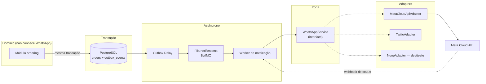
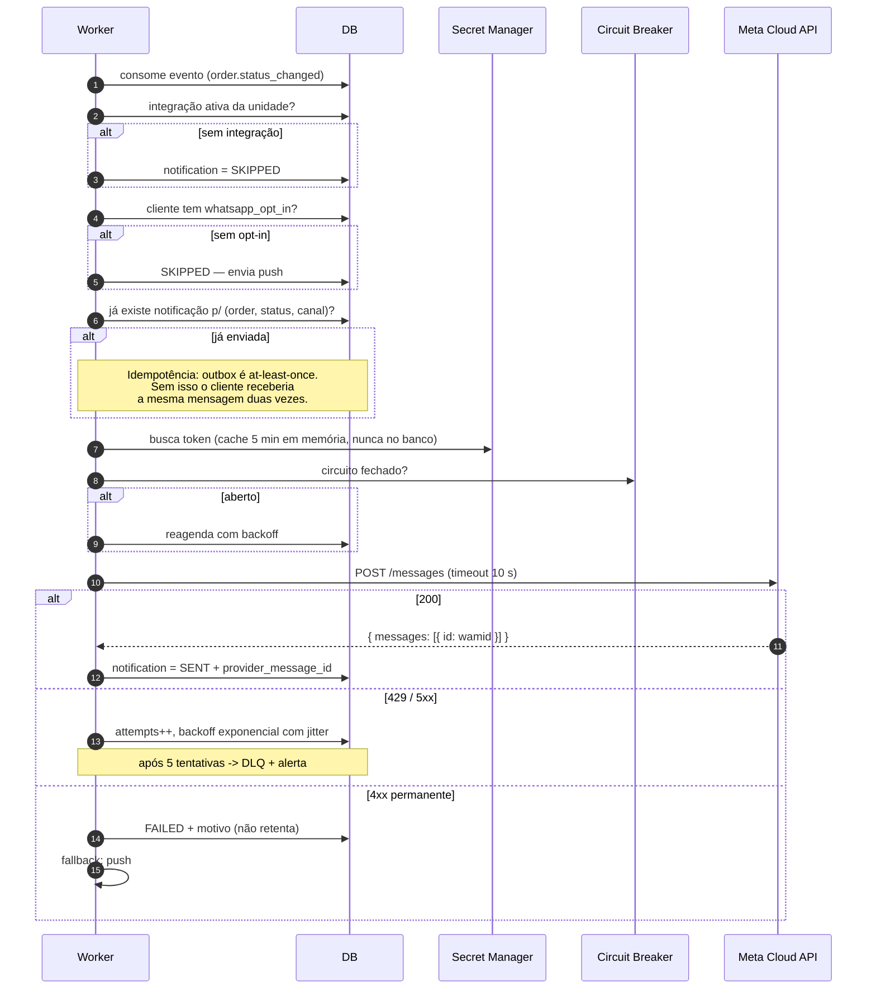
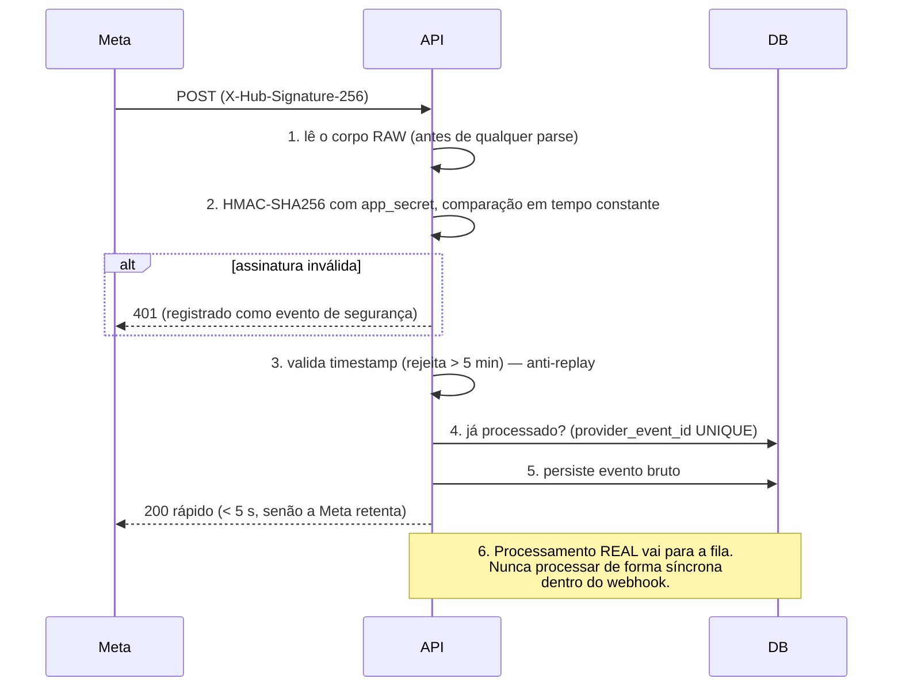

# 08 — Integração com WhatsApp

> Item 9 da Regra Fundamental.

---

## 1. Decisão fundamental: apenas a API oficial

O briefing é explícito: *"Não utilizar automações não oficiais que possam provocar bloqueio da conta."*
Concordo, e vale registrar por quê, porque a tentação técnica é real — bibliotecas como `whatsapp-web.js`
e `Baileys` funcionam, são gratuitas e instalam em minutos.

| | **WhatsApp Business Platform (Cloud API)** | Automação não oficial (Baileys, whatsapp-web.js) |
|---|---|---|
| Situação | Oficial, contratual | **Viola os Termos de Serviço** |
| Risco à conta | Nenhum | **Banimento permanente do número do lojista** |
| Estabilidade | SLA e versionamento | Quebra a cada atualização do WhatsApp Web |
| Escala | Milhares de mensagens/s | Uma sessão por número, frágil |
| Custo | Por conversa | "Grátis" |
| Confiabilidade | Webhooks de entrega/leitura | Nenhuma |

O custo do banimento não é nosso: é do lojista, que perde o canal principal de contato com os clientes
dele. É risco que não temos o direito de assumir em nome de terceiros. Decisão registrada em
[ADR-0009](adr/ADR-0009-whatsapp-cloud-api-oficial.md).

---

## 2. Arquitetura: WhatsApp nunca no caminho crítico



O módulo `ordering` **não sabe que WhatsApp existe**. Ele grava `outbox_events` e comita. Se a Meta estiver
fora do ar, a fila acumula e drena depois — o pedido nunca é afetado. É o requisito explícito do briefing
("se a API do WhatsApp estiver indisponível, o pedido continuará funcionando normalmente"), garantido
estruturalmente e não por boa intenção.

### A porta

```typescript
export interface WhatsAppService {
  sendTemplate(input: {
    integrationId: string;
    toPhoneE164: string;
    templateName: string;
    languageCode: string;
    variables: Record<string, string>;
    idempotencyKey: string;
  }): Promise<{ providerMessageId: string }>;

  sendSessionMessage(input: {          // só dentro da janela de 24 h
    integrationId: string;
    toPhoneE164: string;
    text: string;
  }): Promise<{ providerMessageId: string }>;

  verifyWebhookSignature(rawBody: Buffer, signature: string, secret: string): boolean;
  parseWebhook(payload: unknown): WhatsAppEvent[];
}
```

Interface deliberadamente estreita e livre de vocabulário da Meta: nada de `phone_number_id`, `wamid` ou
formato de payload vazando para o domínio. Trocar de provedor é escrever um adapter — não reescrever o
sistema, exatamente como o briefing pede.

`NoopAdapter` é o padrão em desenvolvimento e teste: registra o que teria enviado e não chama a rede.
Nenhum desenvolvedor precisa de credencial da Meta para rodar o projeto, e nenhum teste envia mensagem
para um número real por acidente.

---

## 3. Regras da plataforma que moldam o desenho

Três regras da Meta não são detalhe de implementação — elas determinam a arquitetura:

### 3.1 Janela de atendimento de 24 horas
Mensagem de **texto livre** só pode ser enviada dentro de 24 h após a última mensagem do cliente. Fora
disso, apenas **templates aprovados**.

Como notificação de pedido é iniciada pelo negócio e pode ocorrer a qualquer momento, **todo o fluxo de
status usa templates**. A janela é registrada em `customer_organization_links` e verificada antes de
qualquer envio de texto livre.

### 3.2 Templates precisam de aprovação prévia
Cada mensagem é um template submetido à Meta, com variáveis posicionais, categoria e idioma. Aprovação
leva de minutos a dias. **Isso não pode estar no caminho de um deploy** — daí `whatsapp_integrations.template_map`,
que mapeia evento de domínio → nome do template aprovado, configurável por organização sem alteração de código.

### 3.3 Opt-in explícito
A Meta exige consentimento comprovável. Registramos em `customer_organization_links.whatsapp_opt_in` com
data e origem. Sem opt-in, **nenhuma** mensagem é enviada — o worker marca a notificação como `SKIPPED`,
e o cliente recebe por push.

---

## 4. Templates do fluxo de pedido

Categoria **UTILITY** (transacional). Não usar MARKETING para status de pedido: custo maior, exigência de
consentimento diferente e risco de queda na avaliação de qualidade.

| Evento | Template | Corpo |
|---|---|---|
| `order.created` | `pedido_recebido` | "Pedido *#{{1}}* recebido em {{2}}! Valor: R$ {{3}}. Acompanhe pelo app." |
| Pix pendente | `pedido_aguardando_pagamento` | "Pedido *#{{1}}* — R$ {{2}}. Aguardando o Pix. Você tem {{3}} minutos." |
| `CONFIRMED` | `pedido_confirmado` | "Pagamento confirmado! Pedido *#{{1}}* em breve na produção." |
| `PREPARING` | `pedido_em_preparacao` | "Pedido *#{{1}}*: em preparação. Previsão: {{2}}." |
| `READY` + retirada | `pedido_pronto_retirada` | "Pedido *#{{1}}* pronto para retirada em {{2}}!" |
| `OUT_FOR_DELIVERY` | `pedido_em_rota` | "Pedido *#{{1}}* saiu para entrega. Chega em ~{{2}} min." |
| `DELIVERED` / `PICKED_UP` | `pedido_entregue` | "Pedido *#{{1}}* entregue. Obrigado pela preferência!" |
| `CANCELLED` | `pedido_cancelado` | "Pedido *#{{1}}* cancelado. Motivo: {{2}}." |

Cobre exatamente os exemplos do briefing ("Pedido #1042", "Valor: R$ 48,90", "Status: Em preparação",
"Pronto para retirada", "Saiu para entrega", "Pedido entregue").

**Variáveis são sempre escapadas e limitadas**: sem quebra de linha, sem `*`/`_` não intencionais, tamanho
máximo. Nome de produto vindo do cadastro do lojista é conteúdo não confiável — não pode injetar formatação
nem quebrar o template.

---

## 5. Envio, com todas as proteções



| Controle | Detalhe |
|---|---|
| Idempotência | Chave `(order_id, to_status, channel)` — evento reprocessado não gera mensagem duplicada |
| Timeout | 10 s; sem timeout, um worker travado consome a fila inteira |
| Circuit breaker | Abre com taxa de erro alta, semiabre em 30 s |
| Backoff | Exponencial com jitter, máximo 5 tentativas, depois DLQ |
| Fallback | Push notification quando o WhatsApp falha em definitivo |
| Segredo | Buscado do secret manager por requisição (cache curto em memória) — **nunca** persistido |
| Ordenação | Mensagens do mesmo pedido processadas em série (chave de fila por `order_id`), para o cliente não ler "entregue" antes de "saiu para entrega" |

---

## 6. Webhooks de entrada

Endpoint: `POST /v1/webhooks/whatsapp`



Eventos tratados: `sent`, `delivered`, `read`, `failed` (atualizam `notifications`), mensagens recebidas
do cliente (abrem a janela de 24 h), e **opt-out** — "PARAR"/"SAIR" desliga `whatsapp_opt_in`
imediatamente. Respeitar o descadastro é exigência da plataforma e da LGPD.

A verificação inicial (`GET` com `hub.challenge`) usa `verify_token` guardado por referência no secret
manager.

---

## 7. Multi-tenancy da integração

Cada organização (ou unidade) tem sua própria configuração em `whatsapp_integrations`:

| Campo | Observação |
|---|---|
| `phone_number_id`, `waba_id` | Identificadores da Meta |
| `access_token_secret_ref` | **Referência** (ARN), não o token. Um dump do banco não entrega o WhatsApp de nenhum lojista |
| `app_secret_ref`, `webhook_verify_token_ref` | Idem |
| `template_map` | Evento de domínio → template aprovado. Permite nomes/idiomas diferentes por franquia |
| `quality_rating` | Espelho da avaliação da Meta; queda dispara alerta |
| `is_active` | Desligar uma franquia não afeta as outras |

Como o webhook chega em um endpoint único, o roteamento é feito por `phone_number_id` → integração →
organização. Enquanto a organização não for resolvida, o evento é tratado como não confiável.

**Isolamento de falha:** token expirado do lojista A não afeta o lojista B — circuit breaker e contadores
de erro são por integração.

---

## 8. Custos e controle de abuso

O WhatsApp cobra **por conversa**, não por mensagem. Sem controle, isso vira despesa fora de controle e
incentivo a spam.

| Controle | Implementação |
|---|---|
| Orçamento por organização | Teto mensal de conversas; ao atingir, cai para push e alerta o administrador |
| Deduplicação | Nunca duas mensagens para o mesmo `(pedido, status)` |
| Agregação | Transições em rajada (< 60 s) enviam apenas a última |
| Só o que importa | Transições internas não geram mensagem |
| Métricas | Conversas por organização, custo estimado, taxa de entrega e leitura, avaliação de qualidade |
| Proteção de qualidade | Alta taxa de bloqueio pelos clientes reduz a avaliação e o limite de envio da Meta — monitorado, com corte automático da franquia problemática |

---

## 9. Estratégia de testes

| Camada | Abordagem |
|---|---|
| Domínio | `NoopAdapter` — testes de pedido nunca tocam a rede |
| Adapter | Servidor HTTP fingido reproduzindo respostas reais da Meta (200, 429, 4xx, 5xx) |
| Webhook | *Fixtures* reais da Meta; casos de assinatura inválida, replay e evento duplicado |
| Resiliência | Teste de caos: adapter derrubado durante criação de pedido — o pedido **precisa** ser criado normalmente |
| Contrato | Verificação periódica do formato de resposta da API da Meta em staging |

---

## 10. Evolução

| Fase | Escopo |
|---|---|
| **1** | Notificações de status por template (unidirecional) |
| **2** | Webhooks de entrega/leitura + opt-out + fallback para push |
| **3** | Atendimento humano na janela de 24 h (respostas do cliente encaminhadas ao painel) |
| **4** | Botões interativos ("Acompanhar pedido", "Repetir pedido") |
| **5** | Avaliado, não prometido: pedido pelo próprio WhatsApp (Flows) |

A porta `WhatsAppService` não muda entre as fases 1 e 4 — apenas ganha métodos. É o teste real de que a
fronteira foi desenhada no lugar certo.
