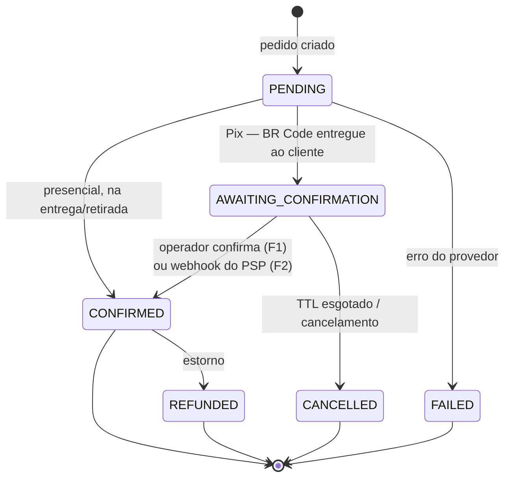
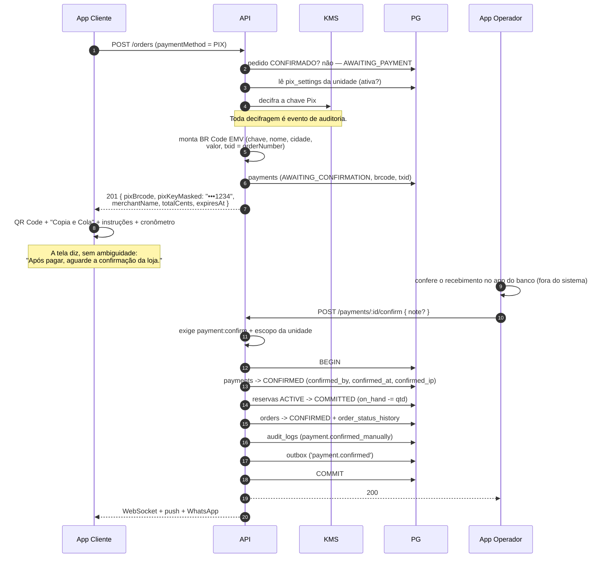
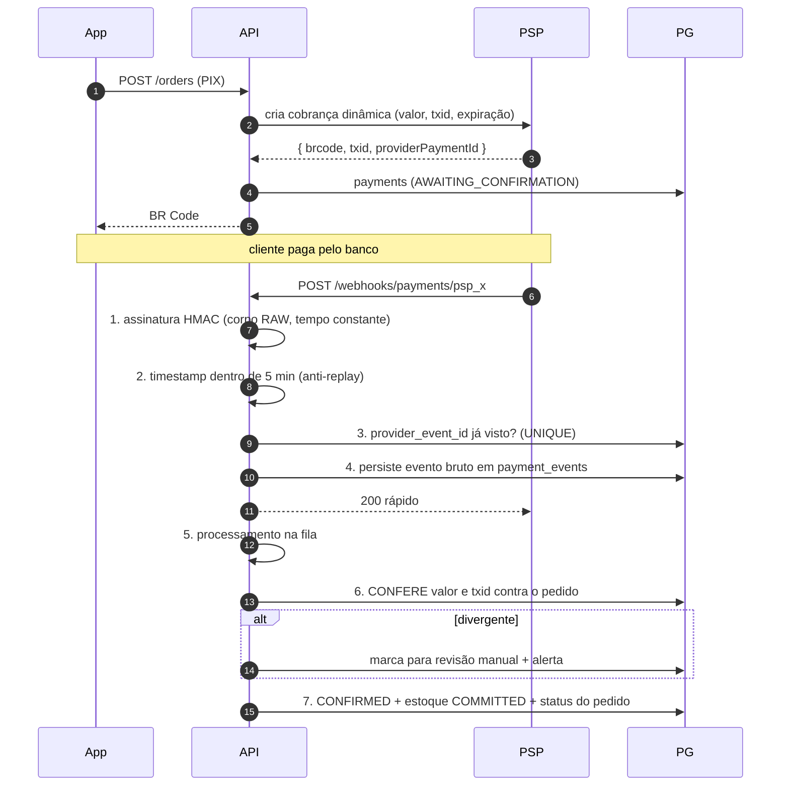

# 10 — Pagamentos

> Complementa o item 2 (arquitetura proposta) detalhando o §3 do briefing.

---

## 1. Abstração: uma porta, vários provedores

O requisito central é temporal: **hoje** a confirmação é manual, **amanhã** vem de um PSP. Se o código
souber disso, a troca custa uma reescrita. Se não souber, custa um adapter.

```typescript
export interface PaymentProvider {
  readonly code: string;                    // 'MANUAL_PIX' | 'ON_SITE' | 'PSP_X'
  readonly supportsAutomaticConfirmation: boolean;

  createCharge(input: {
    orderId: string;
    branchId: string;
    amountCents: number;
    expiresAt: Date;
  }): Promise<ChargeResult>;                // { providerPaymentId?, pixBrcode?, txid? }

  confirm(input: ConfirmInput): Promise<PaymentResult>;
  cancel(paymentId: string): Promise<void>;
  refund(paymentId: string, amountCents: number): Promise<RefundResult>;
  parseWebhook?(raw: Buffer, signature: string): PaymentEvent[];
}
```

| Implementação | Situação | Confirmação |
|---|---|---|
| `ManualPixProvider` | **Fase 1** | Operador, com auditoria completa |
| `OnSiteProvider` | **Fase 1** | Operador, na entrega/retirada |
| `PspPixProvider` | **Fase 2** | Webhook assinado do PSP — automática |
| `CardOnlineProvider` | Avaliado, não prometido | Tokenização + 3DS |

O módulo `ordering` conhece apenas `PaymentProvider`. `payments` já nasce agnóstico
(`provider`, `provider_payment_id`, `payment_events`), então a Fase 2 **não altera** `orders`,
`order_items` nem a máquina de estados. [ADR-0008](adr/ADR-0008-pix-manual-com-abstracao-psp.md)

---

## 2. Máquina de estados do pagamento



`CONFIRMED` é o único estado que faz o pedido avançar e o estoque ser debitado de fato
(`reserved → on_hand`). Antes disso, a unidade está apenas reservada.

---

## 3. Pix — Fase 1 (sem integração bancária)

### 3.1 Melhoria sobre "copiar a chave"

O briefing pede exibir a chave com botão de copiar. Dá para entregar substancialmente mais **sem
integração nenhuma**: o padrão Pix (EMV® QR Code, BR Code) permite gerar localmente um código
"Copia e Cola" **já com valor e identificação embutidos**, a partir da chave cadastrada.

| Abordagem | Cliente precisa | Erro de digitação | Custo |
|---|---|---|---|
| Só a chave (briefing) | Colar a chave, digitar o valor | Provável | Zero |
| **BR Code EMV estático** (escolhido) | Colar e confirmar — valor já vem preenchido | **Eliminado** | Zero |
| Cobrança dinâmica via PSP (Fase 2) | Idem, **com confirmação automática** | Eliminado | Taxa do PSP |

O BR Code é apenas uma formatação padronizada (EMV, campos TLV com CRC16) dos dados que **já temos**:
chave, nome do recebedor, cidade e valor. Não envolve banco, não envolve custo, e reduz drasticamente o
erro de valor — que é a principal causa de divergência na conciliação manual.

**O que continua igual:** copiar/pagar **não confirma nada**. O BR Code estático não gera notificação
de recebimento. A confirmação continua manual até a Fase 2, exatamente como o briefing determina.

### 3.2 Fluxo



### 3.3 Controles da confirmação manual

Este é o ponto de maior risco de fraude interna do sistema na Fase 1. Sete controles:

| Controle | Detalhe |
|---|---|
| Permissão | `payment:confirm` + escopo da unidade |
| Valor | Vem de `orders.total_cents` — **nunca** da requisição |
| Não repúdio | `confirmed_by`, `confirmed_at`, `confirmed_ip` + `audit_logs` |
| Idempotência | Pagamento já `CONFIRMED` retorna `409` |
| Alerta | Confirmação fora do horário de funcionamento notifica o gerente |
| Conciliação | Relatório diário: total confirmado × extrato do lojista |
| Reversão | Confirmação indevida é revertida por `UNIT_MANAGER`+ com motivo, gerando novo evento (o registro anterior **não** é apagado) |

### 3.4 Proteção da chave Pix

Trocar a chave Pix redireciona **todo** o dinheiro que entra. É a alteração de maior impacto financeiro
do sistema e recebe tratamento proporcional:

- Cifrada em repouso (envelope KMS); apenas `key_last4` em claro.
- Decifrada só ao gerar um BR Code — e cada decifragem é auditada.
- `pix_settings:update` negado a `OPERATOR`.
- `UNIT_MANAGER` precisa de **reautenticação (step-up MFA)**.
- Alteração **alerta o `FRANCHISE_ADMIN`** imediatamente.
- `key_fingerprint` (HMAC) permite detectar troca sem decifrar.
- Exibida sempre mascarada no painel.

---

## 4. Pagamento presencial

Três métodos: `CREDIT_ON_SITE`, `DEBIT_ON_SITE`, `CASH_ON_SITE`. "Presencial" significa pagamento na
retirada ou ao entregador — nenhum dado de cartão **jamais** trafega ou é armazenado pelo sistema, o que
mantém o produto fora do escopo de PCI-DSS. Decisão deliberada: capturar cartão sem necessidade seria
adicionar a obrigação regulatória mais cara do setor para resolver um problema que a maquininha da loja
já resolve.

| Aspecto | Tratamento |
|---|---|
| Fluxo | Pedido vai direto a `CONFIRMED` (auto-aceite) ou aguarda aceite do operador |
| Confirmação do pagamento | Na entrega/retirada, pelo operador ou entregador |
| Troco | Campo `change_for_cents` no pedido; o app calcula e **exibe ao operador** — informação operacional, não financeira |
| Risco | Pedido não retirado / recusa na entrega. Mitigação: histórico de não comparecimento por cliente, e possibilidade de a unidade exigir Pix antecipado de reincidentes |
| Registro | `payment_method` gravado explicitamente, como exige o briefing |

---

## 5. Fase 2 — integração com PSP



Sete controles no webhook, todos necessários: **assinatura** (senão qualquer um confirma pagamentos),
**anti-replay** (senão o mesmo evento é reenviado), **idempotência** (PSPs reenviam por design),
**registro bruto** (base de conciliação e disputa), **resposta rápida** (senão o PSP retenta e amplifica),
**conferência de valor e `txid`** (senão um pagamento de R$ 1 confirma um pedido de R$ 200) e
**processamento assíncrono**.

O que **não** muda na Fase 2: `orders`, `order_items`, `order_status_history`, a máquina de estados do
pedido, o fluxo de estoque e os apps. Só entra um novo adapter e a configuração da unidade passa a
apontar para ele. Essa é a prova de que a abstração está no lugar certo.

---

## 6. Estornos

| Situação | Fluxo |
|---|---|
| Cancelamento antes do preparo | Estorno integral; estoque liberado |
| Cancelamento durante o preparo | Decisão do gerente: integral ou parcial; motivo obrigatório |
| Pedido não entregue | Estorno integral + registro da ocorrência |
| Fase 1 (Pix manual) | Estorno **fora do sistema** (o lojista devolve pelo banco); o sistema registra `REFUNDED` com ator, valor e motivo |
| Fase 2 (PSP) | Estorno pela API do provedor, com confirmação por webhook |

`order:refund` é restrito a `UNIT_MANAGER`+. Todo estorno é auditado. `payments.refunded_at` marca o
evento; o registro original **nunca** é alterado — a trilha financeira é append-only por princípio.

---

## 7. Conciliação e antifraude

| Relatório / alerta | Objetivo |
|---|---|
| Confirmado no sistema × extrato do lojista (diário) | Detectar confirmação sem recebimento |
| Pedidos `AWAITING_PAYMENT` expirados por unidade | Medir abandono e detectar problema de UX |
| Confirmações por operador, por hora | Detectar padrão anômalo |
| Confirmações fora do horário de funcionamento | Alerta imediato |
| Cancelamentos após confirmação de pagamento | Possível fraude interna |
| Tempo médio entre criação e confirmação | Indicador operacional |
| Estornos por operador | Vetor clássico de desvio |

Nenhum desses substitui a integração com PSP. Eles **reduzem a janela** de fraude interna e a tornam
detectável — que é o máximo alcançável enquanto a confirmação depender de um humano. Registrado como risco
aceito em [`09` §5](09-ameacas-e-mitigacoes.md).

---

## 8. Regras de dinheiro

| Regra | Motivo |
|---|---|
| `BIGINT` em **centavos**, nunca `float` | `0.1 + 0.2 ≠ 0.3` em ponto flutuante binário |
| `currency CHAR(3)` explícito | Preparado para outras moedas; evita ambiguidade |
| `CHECK (total = subtotal + taxa − desconto)` | Bug de cálculo aborta a transação (**verificado**) |
| Snapshot de preço em `order_items` | O pedido de ontem não muda quando o preço muda hoje |
| Arredondamento só na apresentação | Cálculo sempre em inteiro |
| Um pagamento ativo por pedido | Índice único parcial |
| Nenhum valor monetário aceito do cliente | Integridade financeira |
