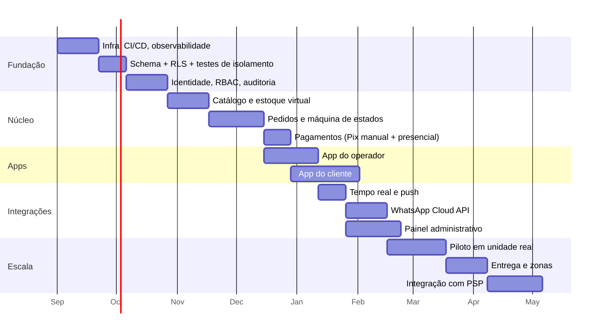

# 11 — Roadmap de Implementação

> Complementar aos 10 itens exigidos. Define **em que ordem** construir, com critérios de aceite
> verificáveis — e, principalmente, o que **não** construir agora.

---

## 1. Ordem de construção (e por quê)

A sequência não é arbitrária: cada fase entrega uma fatia vertical funcionando ponta a ponta, e as
fundações de segurança vêm **antes** da primeira tela, porque enxertar isolamento de tenant em um sistema
que já tem dados é uma migração de risco, não uma tarefa.

**O app do operador vem antes do app do cliente.** Sem alguém para receber o pedido, um pedido bonito
não vale nada. Além disso, o operador é público interno: dá para pilotar com uma loja real e corrigir a
operação antes de expor a marca ao consumidor final.

---

## 2. Fases, entregáveis e critérios de aceite

### Fase 0 — Fundação (3 semanas)

| Entregável | Critério de aceite |
|---|---|
| Monorepo, lint, typecheck, CI | *Pull request* sem verificação verde não faz *merge* |
| Ambientes `dev`/`staging`/`production` isolados | Contas separadas; nenhuma credencial compartilhada |
| Secret manager + rotação | Nenhum segredo em `.env` versionado; gitleaks bloqueante |
| Observabilidade (OTel, Sentry, logs estruturados) | `trace_id` propagado do app até o worker |
| Pipeline de migração | Migração aplicada automaticamente antes do deploy |

### Fase 1 — Dados e isolamento (2 semanas)

| Entregável | Critério de aceite |
|---|---|
| [`sql/schema.sql`](sql/schema.sql) aplicado | ✅ **já validado** contra PostgreSQL 16.13 |
| [`sql/rls-policies.sql`](sql/rls-policies.sql) aplicado | ✅ **já validado** — consulta sem `WHERE` retorna 0 linhas para o tenant errado |
| `assert_rls_coverage()` no CI | ✅ **já pegou 2 falhas reais** (`user_roles`, `product_modifier_groups`) |
| Suíte de concorrência de estoque | ✅ **já validada**: 40 concorrentes / 1 unidade → 1 venda |
| Seeds de desenvolvimento | Duas organizações com dados, para testar isolamento sempre |

> A Fase 1 já está substancialmente comprovada por este trabalho de arquitetura — o que resta é integrar
> os scripts ao pipeline.

### Fase 2 — Identidade, autorização e auditoria (3 semanas)

| Entregável | Critério de aceite |
|---|---|
| Autenticação (OTP + senha/MFA) | Testes de força bruta, enumeração e detecção de reuso passando |
| RBAC com escopo | Matriz rota × papel completa e verde; rota sem `@RequirePermission` **falha o build** |
| `AuditLog` com cadeia de hash | `UPDATE`/`DELETE` recusados; verificador de cadeia rodando |
| Gestão de sessões | Listar e revogar dispositivos; "sair de todos" invalida em < 1 s |

### Fase 3 — Catálogo e estoque (3 semanas)

| Entregável | Critério de aceite |
|---|---|
| CRUD de categorias, produtos e adicionais | Sempre com escopo de unidade |
| Upload de imagem | Reprocessamento com `sharp`, EXIF removido, magic bytes conferidos |
| Estoque virtual | Modos `INFINITE`/`LIMITED`, marcar esgotado, reativar, razão append-only |
| Cardápio público | p95 < 200 ms com cache; disponibilidade **nunca** cacheada |

### Fase 4 — Pedidos (4 semanas)

| Entregável | Critério de aceite |
|---|---|
| Checkout transacional | Preço/taxa/total recalculados no servidor; teste de manipulação falha com `409`/`400` |
| Máquina de estados | Transição inválida → `409`; sem permissão → `403`; histórico imutável |
| Idempotência | Mesma `Idempotency-Key` não cria segundo pedido |
| Numeração amigável | ✅ **validado**: 50 concorrentes → 50 números distintos |
| Expiração de reserva | Pedido Pix abandonado devolve o estoque em até 30 s após o TTL |

### Fase 5 — Pagamentos (2 semanas)

| Entregável | Critério de aceite |
|---|---|
| `PaymentProvider` + `ManualPixProvider` + `OnSiteProvider` | Domínio não conhece provedor concreto |
| BR Code EMV estático | Código validado nos apps dos 5 maiores bancos, com valor correto |
| Confirmação manual auditada | Ator, IP e horário registrados; alerta fora de horário |
| Relatórios de conciliação | Divergência do dia visível ao gerente |

### Fase 6 — Aplicativos (8 semanas, parcialmente paralelas)

| Entregável | Critério de aceite |
|---|---|
| App do operador | Fila de pedidos, som de alerta, transições, esgotado, confirmação de pagamento; funciona com rede instável |
| App do cliente | Vitrine, cardápio com fotos, carrinho, checkout, acompanhamento |
| Design System com tema por franquia | Cores e logo por unidade sem *fork* de código |
| Acessibilidade | Contraste AA, leitor de tela nos fluxos principais, alvos de toque ≥ 44 pt |
| Segurança do app | Zero segredos no bundle (verificado por análise do artefato); token no Keychain/Keystore |

### Fase 7 — Tempo real e WhatsApp (5 semanas)

| Entregável | Critério de aceite |
|---|---|
| WebSocket + Redis adapter | Pedido aparece no operador em < 2 s |
| Push (FCM/APNs) | Entrega com app fechado |
| `WhatsAppService` + `MetaCloudApiAdapter` | **Teste de caos: adapter derrubado ⇒ pedido criado normalmente** |
| Templates aprovados | Os 8 templates do fluxo de status aprovados pela Meta |
| Webhooks de status + opt-out | Assinatura verificada; "PARAR" desliga o envio na hora |

### Fase 8 — Piloto (4 semanas)

Uma unidade real, tráfego real, acompanhamento diário.

| Critério de saída |
|---|
| 500+ pedidos processados sem divergência de estoque |
| Zero incidente de isolamento entre tenants |
| p95 de criação de pedido < 800 ms sob carga real |
| Conciliação de Pix fechando 100% dos dias |
| Operador consegue trabalhar um turno inteiro sem intervenção técnica |

### Fase 9+ — Entrega, PSP e escala

Zonas de entrega com PostGIS, app do entregador, integração com PSP (elimina o risco de fraude na
confirmação manual), particionamento de tabelas, réplica de leitura.

---

## 3. O que **não** construir agora

Escopo negativo é decisão de arquitetura. Cada item abaixo tem ponto de extensão previsto no modelo, e
nenhum será construído antes de demanda real de cliente pagante:

| Item | Por que esperar | Ponto de extensão já previsto |
|---|---|---|
| Cupons e fidelidade | Sem validação de mercado; complica o cálculo de total | `orders.discount_cents` |
| Integração fiscal (NFC-e/SAT) | Complexidade regulatória alta e específica por estado | Módulo isolado consumindo `order.confirmed` |
| Marketplace de entregadores | Depende de volume que ainda não existe | `deliveries.courier_user_id` |
| Multi-idioma / multi-moeda | Mercado inicial é Brasil | `currency` já explícito |
| BI self-service | Relatórios fixos resolvem a Fase 1 | Réplica de leitura |
| Catálogo padronizado da franquia | Precisa de operação real para definir a regra de replicação | `product_templates` na organização |
| Microsserviços | Volume não justifica; ver [ADR-0001](adr/ADR-0001-monolito-modular.md) | Fronteiras de módulo já isoladas |
| Pedido pelo WhatsApp (Flows) | Só após dominar a integração básica | `WhatsAppService` |

---

## 4. Definição de pronto

Nenhuma funcionalidade é considerada concluída sem:

- [ ] Testes unitários das regras de domínio
- [ ] Teste de integração com PostgreSQL **real** (não mock)
- [ ] Entrada na matriz de autorização (rota × papel)
- [ ] Teste de isolamento entre tenants, quando toca dado multi-tenant
- [ ] Eventos de auditoria para operações sensíveis
- [ ] Tratamento de erro com `code` estável e `traceId`
- [ ] Métricas e log estruturado
- [ ] Documentação OpenAPI atualizada
- [ ] Revisão de código por outra pessoa
- [ ] Verificação de segurança quando toca auth, pagamento, estoque ou tenancy

---

## 5. Indicadores de acompanhamento

| Categoria | Indicador |
|---|---|
| Negócio | Pedidos/dia por unidade · ticket médio · taxa de conversão do carrinho · abandono no Pix |
| Operação | Tempo até aceite · tempo de preparo · taxa de cancelamento · pedidos por falta de estoque |
| Técnico | p95 por rota · taxa de erro · lag do outbox · profundidade das filas · pool de conexões |
| Segurança | Falhas de login · reuso de refresh detectado · negações de autorização · alterações de Pix |
| Custo | Conversas de WhatsApp por organização · armazenamento de mídia · custo por pedido |

Alertas ligados a **sintomas de negócio** ("pedidos pararam de entrar nesta unidade"), não apenas a
sintomas de máquina ("CPU em 80%"). O primeiro acorda alguém pelo motivo certo.
